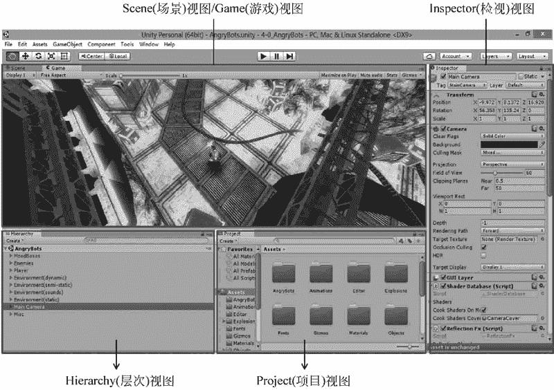
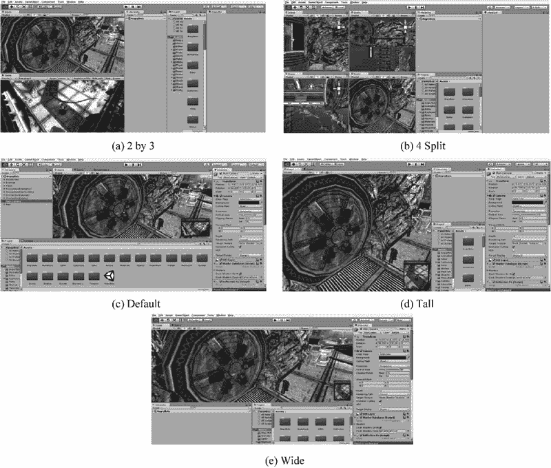

# Unity 3D 界面布局

> 原文：[`c.biancheng.net/view/2647.html`](http://c.biancheng.net/view/2647.html)

Unity 3D 拥有强大的编辑界面，游戏开发者在创建游戏过程中可以通过可视化的编辑界面创建游戏。

Unity 3D 的基本界面非常简单，主要包括菜单栏、工具栏以及五大视图，几个窗口就可以实现几乎全部的编辑功能。

## Unity 3D 界面布局

Unity 3D 主界面如下图所示，Unity 3D 的基本界面布局包括工具栏、菜单栏以及 5 个主要的视图操作窗口，这 5 个视图为 Hierarchy（层次）视图、Project（项目）视图、Inspector（检视）视图、Scene（场景）视图和 Game（游戏）视图。

在 Unity 3D 中有几种类型的视图，每种视图都有指定的用途。

右上角 Layouts 按钮用于改变视图模式，单击 Layouts 选项，可以在下拉列表中看到很多种视图，其中有 2 by 3、4 Split、Default、Tall、Wide 等，如下图所示。

每种视图的特点如下：

*   2 by 3 布局是一个经典的布局，很多开发人员使用这样的布局。
*   4 Spilt 窗口布局可以呈现 4 个 Scene 视图，通过控制 4 个场景可以更清楚地进行场景的搭建。
*   Wide 窗口布局将 Inspector 视图放置在最右侧，将 Hierarchy 视图与 Project 视图放置在一列。
*   Tall 窗口布局将 Hierarchy 视图与 Project 视图放置在 Scene 视图的下方。

当完成了窗口布局自定义时，执行 Windows→Layouts→Save Layout 菜单命令，在弹出的小窗口中输入自定义窗口的名称，单击 Save 按钮，可以看到窗口布局的名称是“自定义”。

