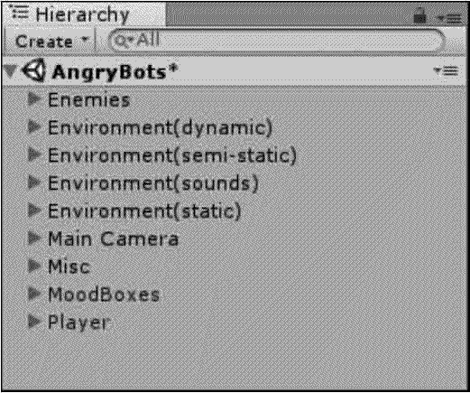
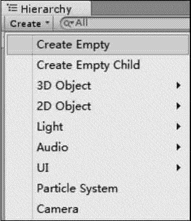
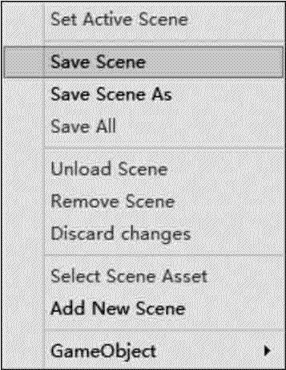
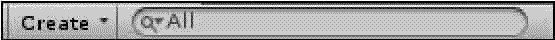

# Unity 3D Hierarchy 视图

> 原文：[`c.biancheng.net/view/2649.html`](http://c.biancheng.net/view/2649.html)

Unity 3D 的 Hierarchy 视图包含了每一个当前场景的所有游戏对象（GameObject），如下图所示。

其中一些是资源文件的实例，如 3D 模型和其他预制物体（Prefab）的实例，可以在 Hierarchy 视图中选择对象或者生成对象。

当在场景中增加或者删除对象时，Hierarchy 视图中相应的对象则会出现或消失。

## 视图布局

在 Unity 3D 的 Hierarchy 视图中，对象是按照字母的顺序排列的，因此，游戏开发者在游戏制作过程中需要避免文件重名，养成良好的命名习惯。

同时，在 Hierarchy 视图中，游戏开发者可以通过对游戏对象建立父子级别的方式对大量对象的移动和编辑进行更加精确和方便的操作。

## 操作介绍

如下图所示，在 Hierarchy 视图中，单击 Create 按钮，可以开启与 GameObject 菜单下相同的命令功能。

如下图所示，在 Hierarchy 视图中，单击右侧的倒三角可以保存场景及加载场景。

如下图所示，在 Hierarchy 视图中，单击搜索区域，游戏开发者可以快速查找到场景中的某个对象。

