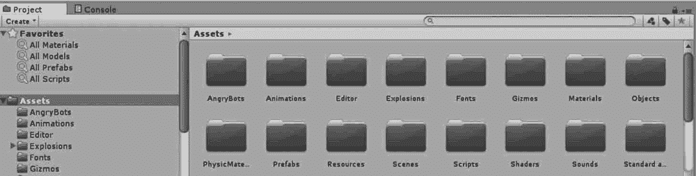

# Unity 3D Project 视图

> 原文：[`c.biancheng.net/view/2650.html`](http://c.biancheng.net/view/2650.html)

Unity 3D 的 Project 视图显示资源目录下所有可用的资源列表，相当于一个资源仓库，用户可以使用它来访问和管理项目资源。

每个 Unity 3D 的项目包含一个资源文件夹，其内容将呈现在 Project 视图中，如下图所示。这里存放着游戏的所有资源，例如场景、脚本、三维模型、纹理、音频文件和预制组件。

如果在 Project 视图里单击某个资源，可以在资源管理器中找到其对应的文件本身。

## 视图布局

Project 视图左侧显示当前文件夹的层次结构，当选中一个文件夹时，它的内容就会显示在右侧。对于显示的资源，可以从其图标看出它的类型，如脚本、材质、子文件夹等。

可以使用视图底部的滑块调节图标的显示尺寸，当滑块移动到最左边时，资源就会以层次列的形式显示出来。当进行搜索时，滑块左边的空间就会显示资源的完整路径。

## 操作介绍

如下图所示，在 Project 视图中，顶部有一个浏览器工具条。左边是 Create 菜单，单击 Create，则会开启与 Assets 菜单下 Create 命令相同的功能。

游戏开发者可以通过 Create 菜单创建脚本、阴影、材质、动画、UI 等资源。

如下图所示，在 Project 视图中，单击搜索区域，游戏开发者可以快速查找到某个资源文件的内容。

搜索框右侧第一个按钮允许通过使用菜单进一步过滤资源，第二个按钮会根据资源的“标签”过滤资源。

如下图所示，在 Project 视图中，左侧顶部是一个名为 Favorites（收藏）的面板，在此处可以保存要经常或频繁访问的资源，这样可以更方便地访问它们。

可以从项目文件夹层次中拖动文件夹到此处，也可以将搜索结果保存到此处。

 如下图所示，在 Project 视图中，右侧顶部是选择项轨迹条，它显示了 Project 视图中当前选中的文件夹的具体路径。

