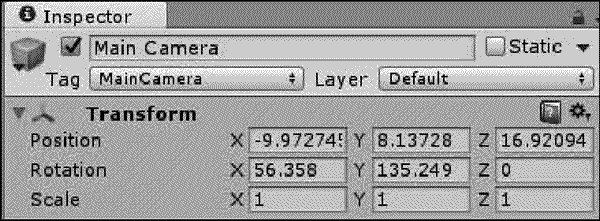
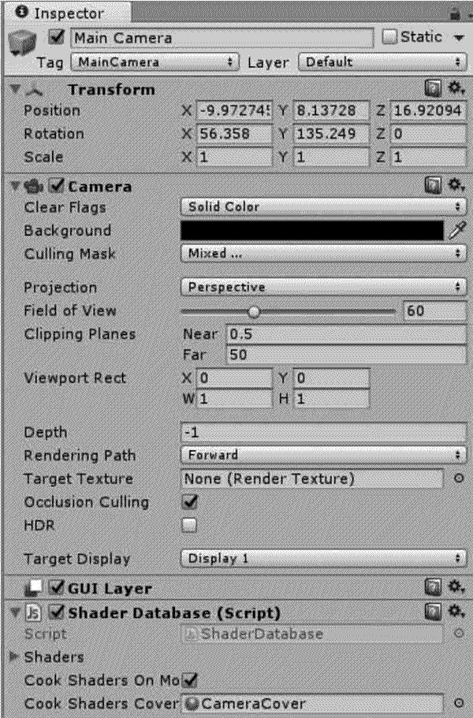
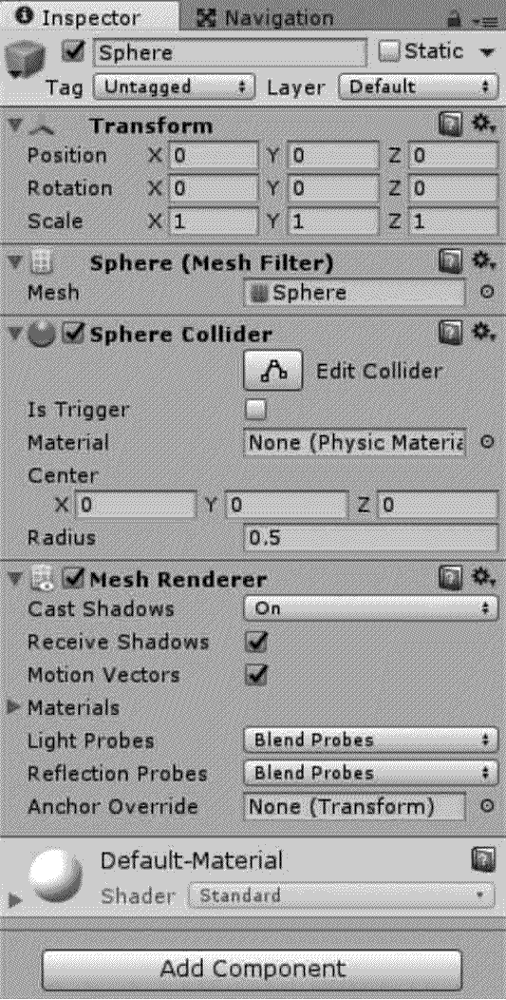

# Unity 3D Inspector 视图

> 原文：[`c.biancheng.net/view/2651.html`](http://c.biancheng.net/view/2651.html)

Unity 3D 的 Inspector 视图用于显示当前选定的游戏对象的所有附加组件（脚本属于组件）及其属性的相关详细信息。

## 视图布局

如下图所示，以摄像机为例，在 Unity 3D 的 Inspector 视图中显示了当前游戏场景中的 MainCamera 对象所拥有的所有组件，游戏开发者可以在 Inspector 视图中修改摄像机对象的各项参数设置。

## 操作介绍

如下图所示，以 Sphere（球）对象为例，在 Unity 3D 的 Inspector 视图中，各项参数如下表所示。

| 参 数 | 含 义 | 功 能 |
| Transform | 转换 | 调节对象 XYZ 轴的位置，改变游戏对象的 Position(位 置）、Rotation(旋转）、Scale(缩放) |
| Sphere(Mesh Filter) | 球体（网格过滤器） | 更换游戏对象的网格类型 |
| Sphere Collider | 球形碰撞体 | 设置球形碰撞体的相关参数 |
| Mesh Render | 网格渲染器 | 设置网格渲染器的相关参数 |
| Materials | 材质 | 指定游戏对象的材质 |