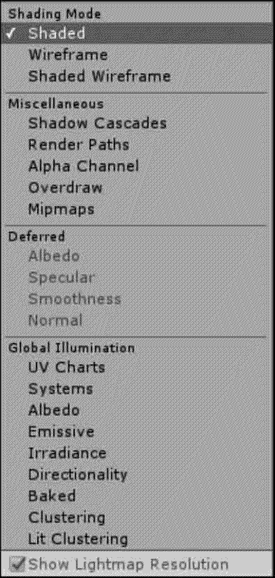

# Unity 3D Scene View 视图

> 原文：[`c.biancheng.net/view/2654.html`](http://c.biancheng.net/view/2654.html)

Unity 3D 的 Scene 视图是交互式沙盒，是对游戏对象进行编辑的可视化区域，游戏开发者创建游戏时所用的模型、灯光、相机、材质、音频等内容都将显示在该视图中。

## 视图布局

Unity 3D 的 Scene 视图用于构建游戏场景，游戏开发者可以在该视图中通过可视化方式进行游戏开发，并根据个人的喜好调整 Scene 视图的位置。

## 操作介绍

如下图所示，Scene 视图上部是控制栏，用于改变相机查看场景的方式。

Scene 视图中包括的绘图模式如下图所示，具体属性参数如下表所示。

| 绘图模式 | 含 义 | 说 明 |
| Shaded | 着色模式（默认模式） | 所有游戏对象的贴图都正常显示 |
| Wireframe | 网格线框显示模式 | 以网格线框形式显示所有对象 |
| Shaded Wireframe | 着色模式线框 | 以贴图加网格线框形式显示对象 |
| Shadow Cascades | 阴影级联 | 以阴影方式显示对象 |
| Render Paths | 渲染路径显示模式 | 以渲染路径的形式显示 |
| Alpha Channel | Alpha 通道显示 | 以灰度图的方式显示所有对象 |
| Overdraw | 以半透明方式显示 | 以半透明的方式显示所有对象 |
| Mipmaps | MIP 映射图显示 | 以 MIP 映射图方式显示所有对象 |

如下图所示，Scene 视图上方有用来切换 2D 与 3D 视图的按钮。

如下图所示，Scene 视图上方有用来控制场景中灯光的打开与关闭的按钮。

如下图所示，Scene 视图上方有用来控制场景中声音的打开与关闭的按钮。

如下图所示，Scene 视图上方有用来控制场景中天空球、雾效、光晕等组件的显示与隐藏的按钮。

如下图所示，Scene（场景）视图上方有用来控制场景中光源的显示与隐藏的按钮。

如下图所示，Scene 视图右上部提供了查找物体的功能。

