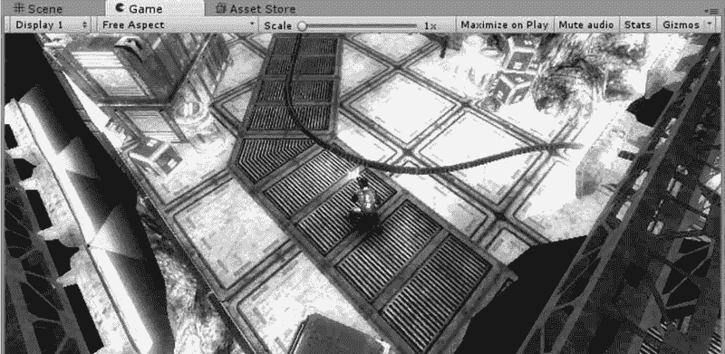
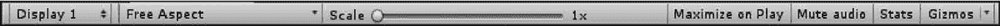

# Unity 3D Game View 视图

> 原文：[`c.biancheng.net/view/2655.html`](http://c.biancheng.net/view/2655.html)

Unity 3D 中的 Game 视图用于显示最后发布的游戏的运行画面，游戏开发者可以通过此视图进行游戏的测试。

## 视图布局

单击播放按钮后，游戏开发者可以在 Game（游戏）视图中进行游戏的预览，并且可以随时中断或停止测试。

## 操作介绍

如下图所示，Game 视图的顶部是用于控制显示属性的控制条，其参数如下表所示。

| 参 数 | 含 义 | 功 能 |
| Free Aspect | 自由比例（默认） | 调整屏幕显示比例，默认为自由比例 |
| Maximize on Play | 运行时最大窗口 | 切换游戏运行时最大化显示场景 |
| Mute audio | 静音 | 控制游戏在运行预览时静音 |
| Stats | 统计 | 单击此按钮，弹出 Statistics 面板，显示运行场景的渲染速 度、帧率、内存参数等内容 |
| Gizmos | 设备 | 单击其右侧的三角符号可以显示或隐藏场景中的灯光、声 音、相机等游戏对象图标 |