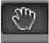
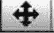

# Unity 3D 工具栏和常用工具简介

> 原文：[`c.biancheng.net/view/2664.html`](http://c.biancheng.net/view/2664.html)

Unity 3D 的工具栏（Toolbar）中，一共包含 13 种常用工具，如下表所示。

| 图 标 | 工具名称 | 功 能 | 快捷键 |
|  | 平移窗口工具 | 平移场景视图画面 | 鼠标中键 |
|  | 位移工具 | 针对单个或两个轴向做位移 | W |
|  | 旋转工具 | 针对单个或两个轴向做旋转 | E |
|  | 缩放工具 | 针对单个轴向或整个物体做缩放 | R |
|  | 矩形手柄 | 设定矩形选框 | T |
|  | 变换轴向 | 与 Pivot 切换显示，以对象中心轴线为参考轴做移动、旋转及缩放 | 无 |
|  | 变换轴向 | 与 Center 切换显示，以网格轴线为参考轴做移动、 旋转及缩放 | 无 |
|  | 变换轴向 | 与 Global 切换显示，控制对象本身的轴向 | 无 |
|  | 变换轴向 | 与 Local 切换显示，控制世界坐标的轴向 | 无 |
|  | 播放 | 播放游戏以进行测试 | 无 |
|  | 暂停 | 暂停游戏并暂停测试 | 无 |
|  | 单步执行 | 单步进行测试 | 无 |
|  | 图层下拉列表 | 设定图层 | 无 |
|  | 页面布局下拉列表 | 选择或自定义 Unity 3D 的页面布局方式 | 无 |