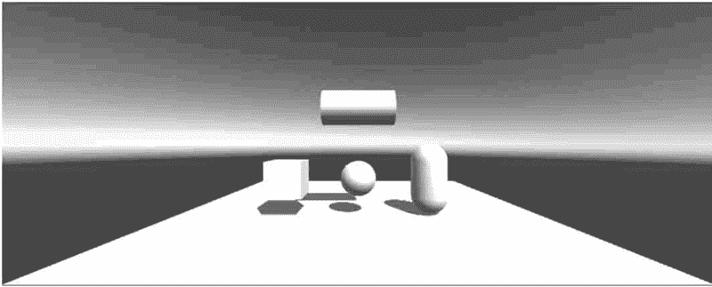

# Unity 3D 创建简单的几何模型

> 原文：[`c.biancheng.net/view/2666.html`](http://c.biancheng.net/view/2666.html)

Unity 3D 是一个强大的游戏开发引擎。在游戏开发中使用的模型常常是从外部导入的，Unity 3D 为了方便游戏开发者快速创建模型，提供了一些简单的几何模型，其中包括立方体、球体、圆柱体、胶囊体等。

下面我们通过案例的形式来了解一下，如何使用 Unity 3D 来创建几何模型

## 实践案例：自由物体创建

#### 案例设计

基本几何体主要是指立方体、球体、胶囊体、圆柱体、平面等，如下图所示。在 Unity 3D 中，可以通过执行 GameObject→3D Object 菜单命令创建基本几何体。

#### 案例实施

步骤 1)：双击软件快捷图标

建立一个空项目。启动 Unity 3D 软件，并设置其名称以及存储路径，单击 Create 按钮即生成一个新项目，如下图所示。

步骤 2)：执行 File→Save Scene 命令，保存场景，将其命名为 scene，单击保存按钮，如下图所示。

 
步骤 3)：创建平面。执行 GameObject→3D Object→Plane 命令，设置位置在（0，-1，-2）处，如下图所示。

步骤 4)：创建球体。选择 GameObject→3D Object→Sphere，设置位置在（0，0，-3）处，如下图所示。

步骤 5)：创建立方体。执行 GameObject→3D Object→Cube 命令，设置位置在（-2，0，-3）处，如下图所示。

步骤 6)：创建胶囊体。执行 GameObject→3D Object→Capsule 命令，设置位置在（2，0，-3）处，如下图所示。

步骤 7)：创建圆柱体。执行 GameObject→3D Object→Cylinder 命令，设置位置在（0，2，-3）处，设置其旋转变量为（0，0，90），如下图所示。

步骤 8)：保存项目。执行 File→Save Project 命令，如下图所示。

步骤 9)：执行 File→Build Settings 命令，弹出 Build Settings 窗口，将当前场景添加到发布项目中，然后选择 PC 平台，最后单击 Build 按钮，如下图所示。

步骤 10)：当完成了打包后，双击可执行文件 Scene.exe，打包后的游戏程序便立即运行起来，此时在场景中出现了一个平面，上面依次摆放着胶囊体、球体、圆柱体以及立方体，在灯光的照射下，游戏对象呈现出奶白色，如下图所示。

