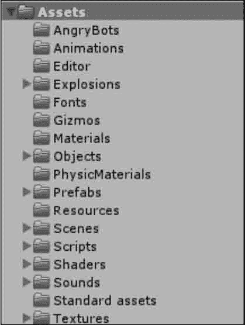
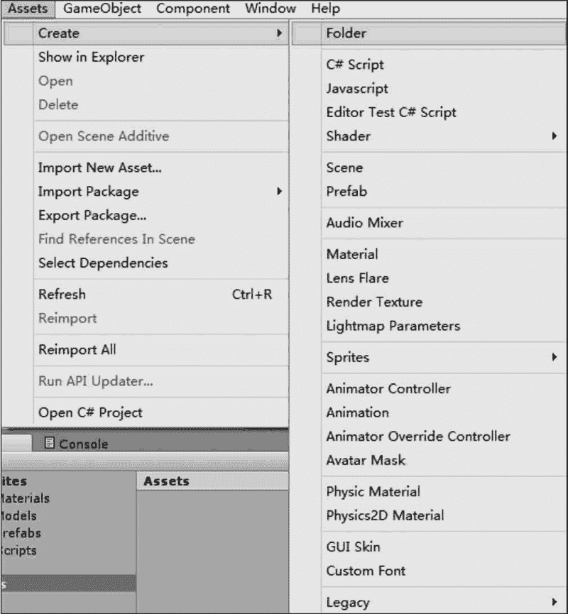
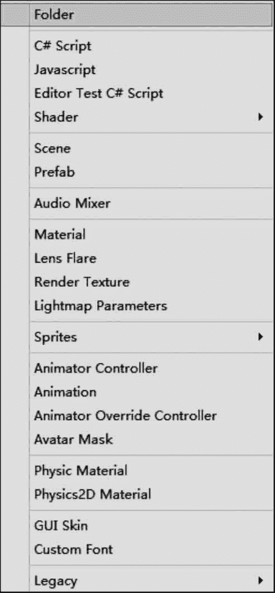
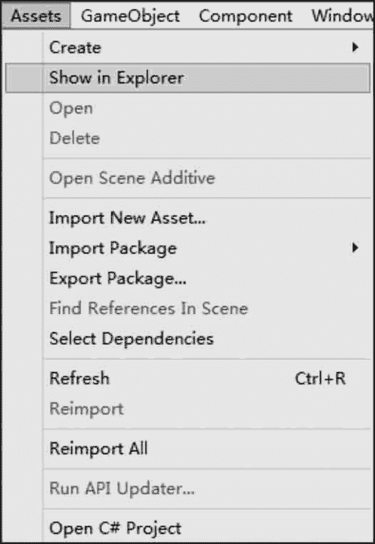
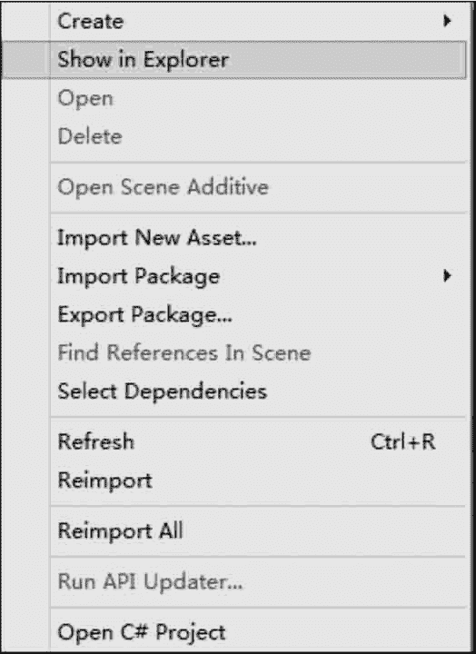

# Unity 3D Assets 游戏资源目录管理

> 原文：[`c.biancheng.net/view/2668.html`](http://c.biancheng.net/view/2668.html)

制作一款游戏，首先需要制定策划案，然后准备游戏资源，一个游戏项目里会有各种各样的资源，需要对资源进行合理的管理。

资源管理最直观的体现在于对文件的归类与命名。在 Unity 3D 中，所有游戏相关文件都被放置在 Assets 文件夹下，如下图所示，常见文件夹的内容如下表所示。

| 文件夹 | 内 容 |
| Models | 模型文件，其中包括自动生成的材质球文件 |
| Prefabs | 预制体文件 |
| Scene | 场景文件 |
| Scripts | 脚本代码文件 |
| Sounds | 音效文件 |
| Texture | 贴图文件 |

同时，在一个 Unity 3D 项目中，通常会有大量的模型、材质以及其他游戏资源，所以需要将游戏资源归类到不同文件夹做分类管理。

一般做法是：在 Unity 3D 软件界面中执行 Assets→Create→Folder 命令，如下图所示，或者直接在 Project 面板中选择 Assets 目录，右击后选择 Create→Folder 命令，如下图所示。

在 Unity 3D 软件界面中执行 Assets→Show in Explorer 命令，可以打开 Assets 文件夹在计算机文件管理器中的实际路径，如下图所示。

也可以直接在 Project 视图中的 Assets 目录上右击，选择 Show in Explorer 命令，这样可以直接将文件复制到游戏项目所在的文件夹中，如下图所示。

