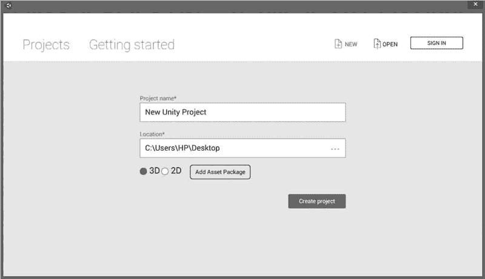
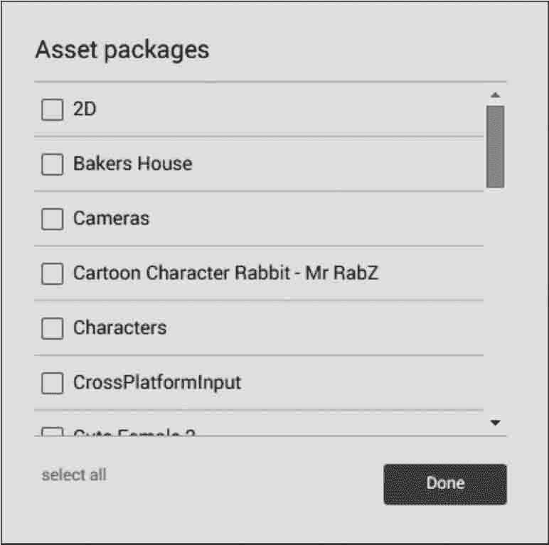
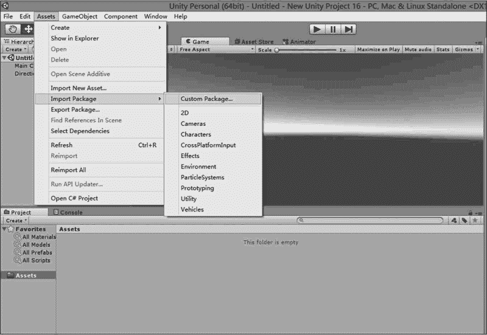
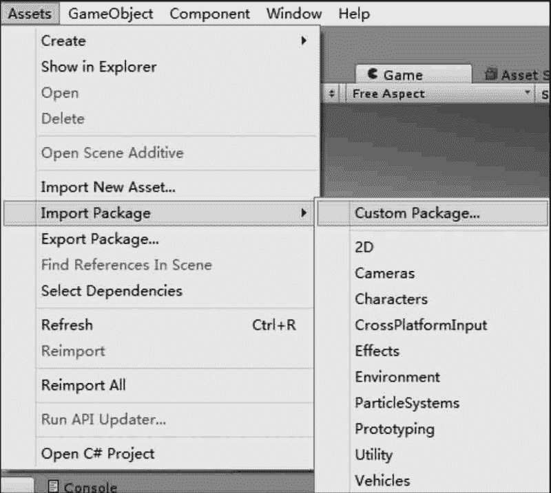
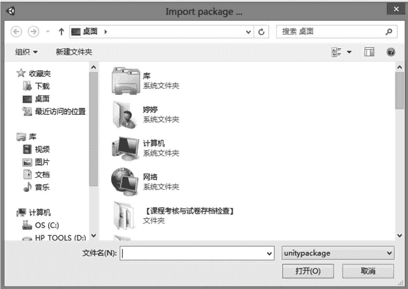
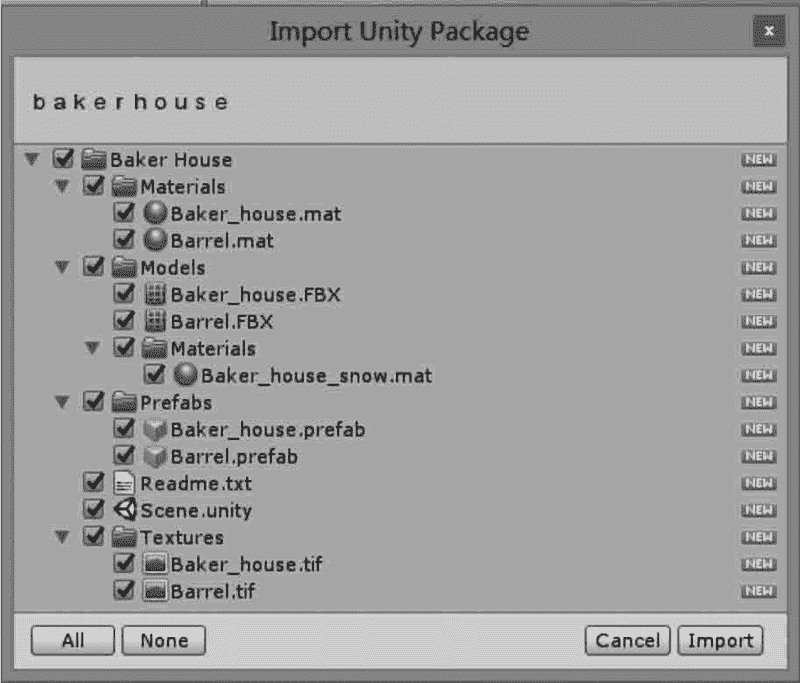

# Unity 3D 导入资源包

> 原文：[`c.biancheng.net/view/2669.html`](http://c.biancheng.net/view/2669.html)

Unity 3D 游戏引擎中有很多资源包，可支持多种主流媒体资源格式，包括模型、材质、动画、图片、音频、视频等，为游戏开发者提供了相当大的便利，也使其开发的游戏作品具有较高的可玩性和丰富的游戏体验。

游戏的资源包分为两种，一种是系统资源包，另一种是外部资源包，游戏开发者可以根据实际情况选择导入不同的资源包。

下面分别介绍一下两种资源包的导入方式。

## 导入系统资源包

系统资源吧的导入有两种方式。

#### 1) 新建项目时导入

在新建项目对话框中单击 Add Asset Packages 按钮，如下图所示

在弹出的对话框中选中所需的资源，系统将自动导入资源，如下图所示。

#### 2) 项目创建完成之后导入

选择 Assets→Import Package 命令，在弹出的下拉菜单中选择需要的系统资源包导入即可，如下图所示。

## 导入外部资源包

外部资源包的导入与系统资源包的导入过程大体一致。

执行 Assets→Import Package→Custom Package（自定义包）菜单命令，如下图所示。

然后在弹出的对话框中选中资源包，单击“打开”按钮，如下图所示。

最后，在弹出的窗口中，根据需要选择合适的资源，单击 Import 按钮完成导入，如下图所示。

