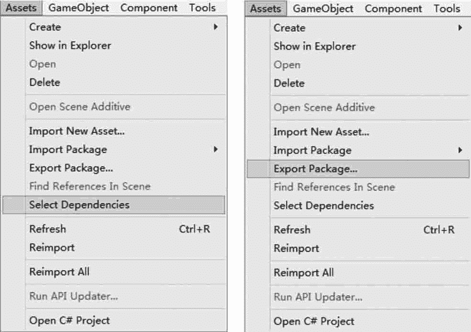
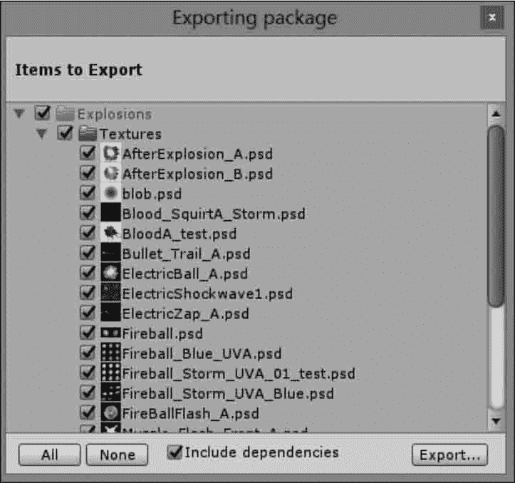
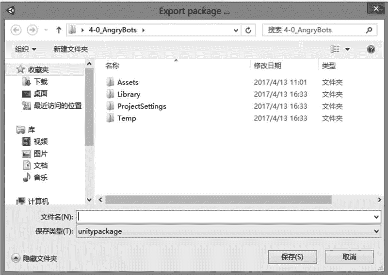

# Unity 3D 导出资源包

> 原文：[`c.biancheng.net/view/2670.html`](http://c.biancheng.net/view/2670.html)

项目中的一些资源可以重复使用，只需要将资源导出，在另一个项目中导入即可。

资源导出的方法是：执行 Assets→Select Dependencies 菜单命令，选中与导出资源相关的内容，然后执行 Assets→Export Package 菜单命令，如下图所示。

在弹出的 Exporting Package（导出资源）对话框中，单击 All 按钮，将要导出的所有文件选中，然后单击 Export 按钮，如下图所示。

接下来在弹出的对话框中设置资源包的保存路径以及资源包的名称，完成后单击“保存”按钮即可，如下图所示。

