# Unity 3D 资源下载

> 原文：[`c.biancheng.net/view/2673.html`](http://c.biancheng.net/view/2673.html)

Unity 3D 为用户提供了丰富的下载资源，其官方网址为 [`www.assetstore.unity3d.com/`](https://www.assetstore.unity3d.com/)，也可以在 Unity 3D 中执行 Window→Asset Store 菜单命令直接访问 Unity 资源商店（Asset Store），如下图所示。

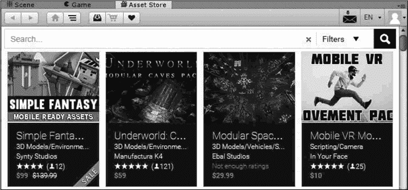

## Unity 资源商店简介

Unity 资源商店中提供了多种游戏媒体资源供下载和购买，例如人物模型、动画、粒子特效、纹理、游戏创作工具、音乐特效、功能脚本和其他类拓展插件等，如下图所示。

用户也可以作为资源的发布者同意在商店中出售或免费提供其开发的资源。

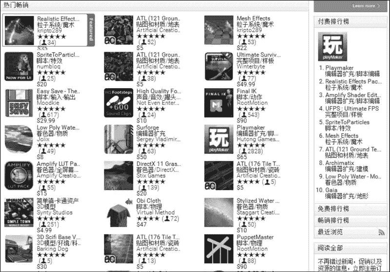

## Unity 资源商店使用

为了帮助开发者制作更加完美的游戏，Unity 提供了大量的特效包帮助开发者提升开发效率，Unity 资源商店里面有各类特效资源供开发者使用。

步骤 1)：打开网络浏览器，进入 Unity 资源商店主页，并创建一个免费账户，如下图所示。

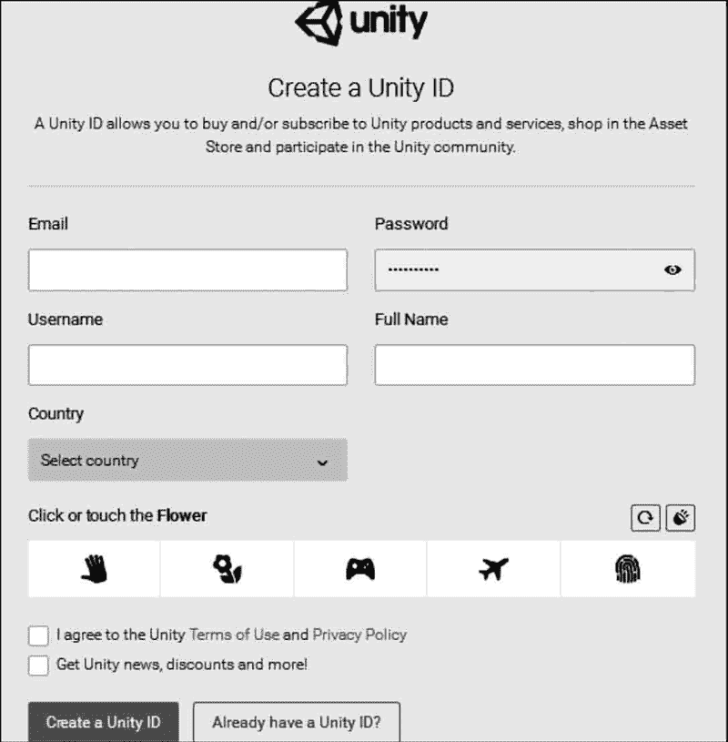
步骤 2)：在 Categories（资源分区）中打开“完整项目”，单击“Unity 功能范例”，选择相应链接，即可观看该资源的详细介绍。

在 Unity 资源商店里有很多种类的资源，大致分类如下表所示。

| 分 类 | 内 容 |
| 3D Models | 3D 模型 |
| Animation | 动画 |
| Audio | 音频 |
| Complete Projects | 完整的项目 |
| Editor Extensions | 编辑器扩展 |
| Particle Systems | 粒子系统 |
| Scripting | 脚本 |
| Services | 服务 |
| Shaders | 着色器 |
| Textures & Materials | 纹理和材质 |

步骤 3)：在资源详细介绍界面中单击 Download 按钮，即可进行自由下载。

当自由下载完毕后，Unity 3D 会自动弹出 Importing Package 对话框，对话框左侧是需要导入的资源文件列表，右侧是资源对应的缩略图，单击 Import 按钮即可将所下载的资源导入到当前的 Unity 3D 项目中。

步骤 4)：资源导入完成后，在 Project 面板下的 Assets 文件夹中会显示出新增的资源文件目录，单击该图标即可载入该案例，只需要单击 Play 按钮即可运行这个游戏案例。

## 综合案例：创建简单 3D 场景

#### 案例构思

游戏中有许多关卡，在创建初期这些关卡叫作场景。一款游戏可以包含若干个场景，因此一个项目中可以保存多个游戏场景。

本案例旨在通过三维场景的创建将资源加载与自由物体创建等知识整合，通过一些外部资源的导入以及系统资源的利用创建一个简单的 3D 场景。

#### 案例设计

本案例计划在 Unity 3D 内创建一个简单 的 3D 场景，场景内创建一个平面用于存放加载的外部资源并加入灯光，然后从外部以及 Unity 资源商店中导入一些基本模型，如下图所示。

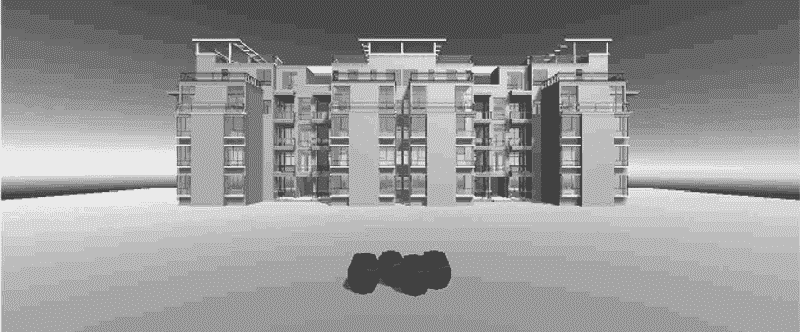

#### 案例实施

步骤 1)：双击 Unity 3D 软件快捷图标

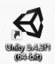
建立一个空项目。启动 Unity 3D 软件，并设置其存储路径，单击 Create 按钮即生成一个新项目，如下图所示。

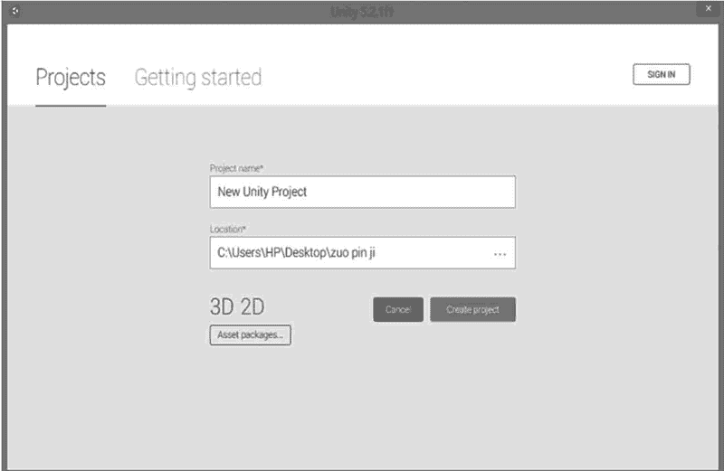
步骤 2)：创建平面。执行 GameObject→3D Object→Plane 命令，如下图所示。

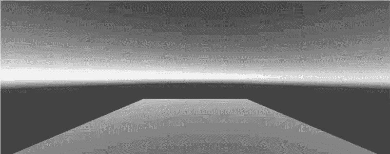
步骤 3)：选择材质。单击 Project 面板 Create 旁边的倒三角，选择 Material（材质），创建一个材质并在属性对话框中对其进行颜色赋值，如下图所示。

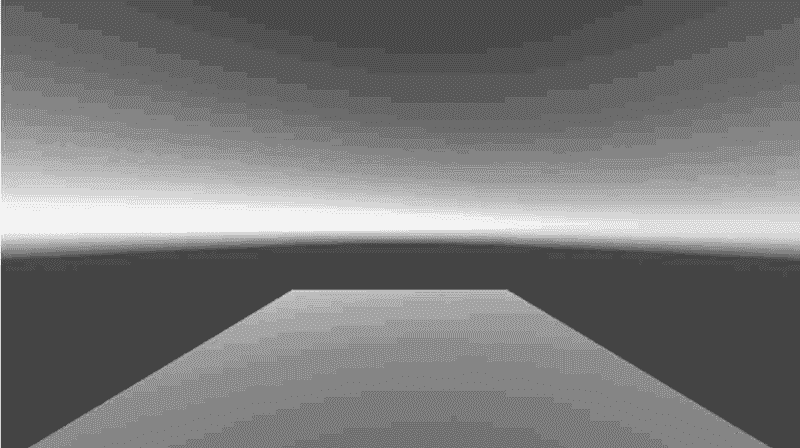
步骤 4)：执行 Window→Assets Store 命令进入 Unity 资源商店，如下图所示。

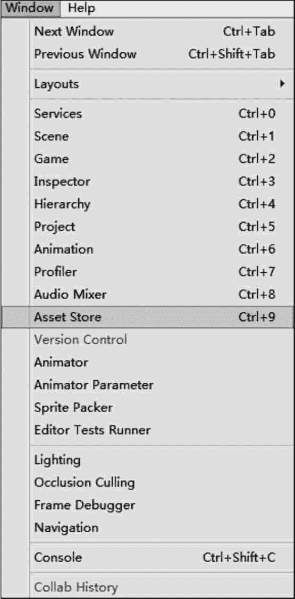
 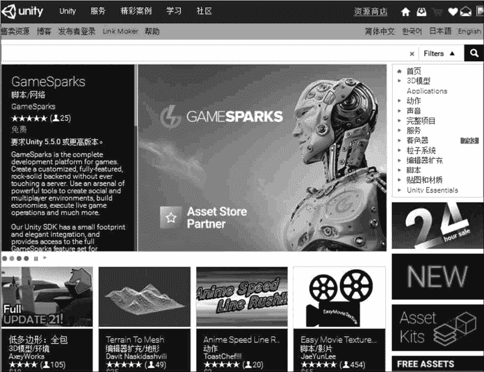
步骤 5)：输入资源商店的账号和密码进行登录，并在窗口右侧选择“3D 模型”下载三维模型，如下图所示。

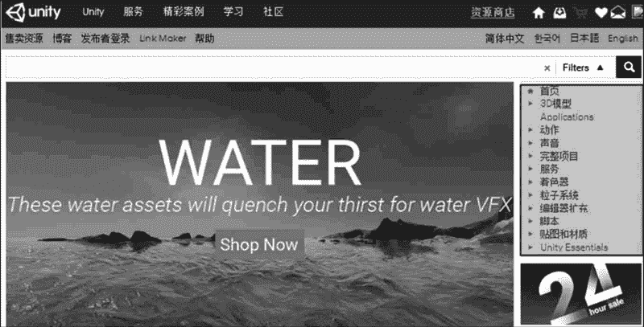
步骤 6)：如下图所示，在 3D 模型列表中选择免费的 Chunky Wooden Barrels 资源。

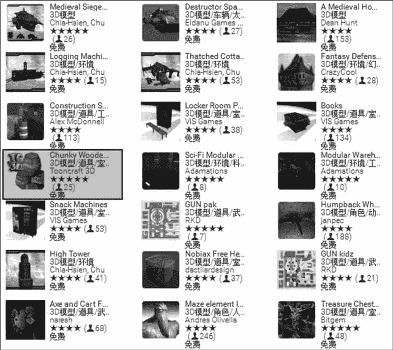
步骤 7)：如下图所示，单击 Add to Downloads 按钮，模型资源下载完成后，单击 Import 按钮将模型导入到 Unity 3D 软件中。

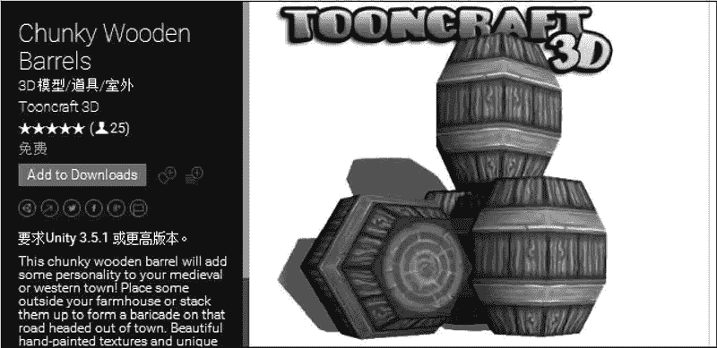
步骤 8)：如下图所示，在弹出的导入资源包对话框中单击 Import 按钮进行 3D 模型导入。导入完成后，将导入的文件拖入 Project 视图中的 Model 文件夹中。

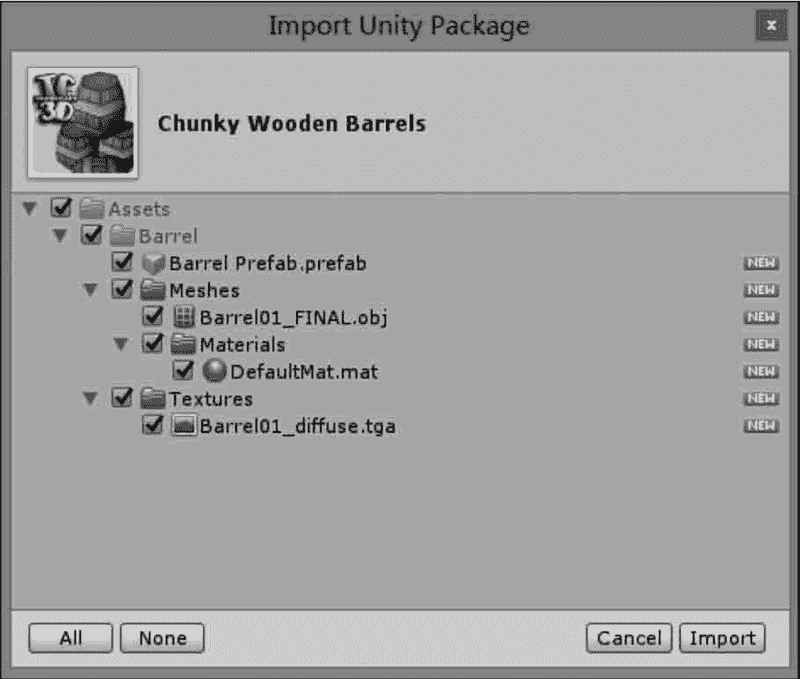
步骤 9)：如下图所示，将 Project 视图中的木桶模型拖入 Scene 视图，并将其摆放至合适的位置。

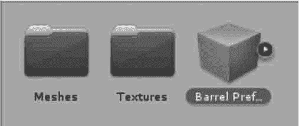
步骤 10)：将建筑模型和贴图文件夹直接拖入 Project 面板，如下图所示。

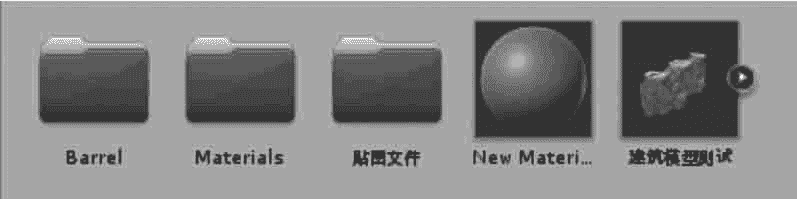
步骤 11)：将建筑模型从 Project 视图中拖入 Hierarchy 视图，调整到合适的位置，使摄像机能够看清建筑模型全景。

步骤 12)：单击 Hierarchy 面板中的建筑模型下拉菜单，根据贴图名字为建筑模型赋予贴图材质，如下图所示。

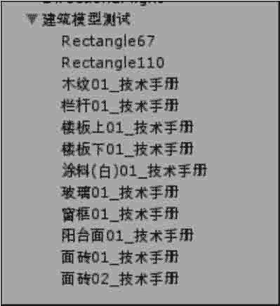
步骤 13)：单击 Play 按钮进行测试，在 Game 视图可以看到最终的木桶摆放效果，如下图所示。

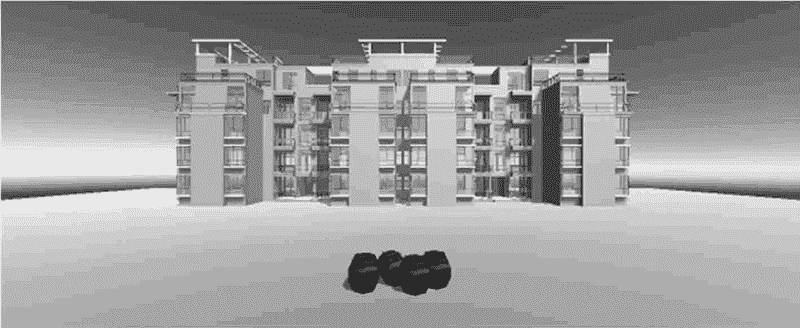
步骤 14)：保存场景。执行 File→Save Scene 命令，输入场景名称并单击“保存”按钮，然后执行 File→Save Project 命令。