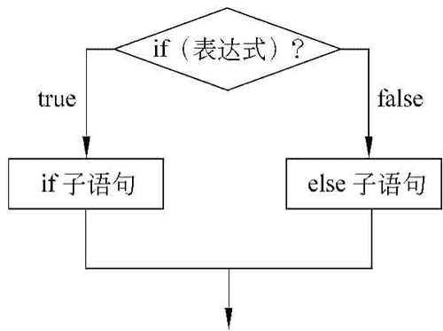
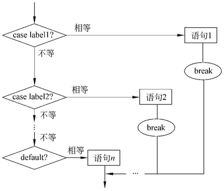

# Unity 3D JavaScript 脚本基础

> 原文：[`c.biancheng.net/view/2677.html`](http://c.biancheng.net/view/2677.html)

Unity 3D 中的 JavaScript 也称 UnityScript，和基于浏览器的 JavaScript 有比较大的区别。

JavaScript 是一种由 Netscape 公司的 LiveScript 发展而来的原型化继承的面向对象类语言，并且是一种区分大小写的客户端脚本语言。

## 变量

JavaScript 有 4 种变量：

#### 1) 数值变量

数值是最基本的数据类型。例如：

```

var a=1000;
var b=3.1415926;
```

#### 2) 字符串变量

是由单引号或者双引号括起来的 Unicode 字符序列。

#### 3) 布尔值

只有两个值：true 和 false，用来表示某个事物为真还是为假。

#### 4) 数组

是数据的集合，数组中的每一个数据元素都有一个编号（下标），数组的下标是从 0 开始的。

## 表达式和运算符

表达式是关键字、变量、常量和运算符的组合，可以用于执行运算、处理字符或测试数据。

JavaScript 的解释引擎可以计算表达式，并返回一个结果值。

JavaScript 的运算符分为以下 6 类。

#### 1) 算术运算符

指的是数学中最基本的加减乘除等运算。算术运算符需要两个操作数，因此也称二元运算符。假设有操作数 a、b，它们的算术运算符如下表所示。

| 算术运算符 | 说 明 | 使用方法 |
| + | 两变量相加 | a + b |
| - | 两变量相减 | a - b |
| * | 两变量相乘 | a * b |
| / | 两变量相除 | a / b |
| % | 求余数 | a % b |
| ++ | 变量做 +1 操作 | a = a + 1 |
| -- | 变量做 -1 操作 | a = a - 1 |

#### 2) 相等运算符

用来比较两个值，根据比较结果返回一个布尔值，广义的相等运算符包含以下 4 种：

*   相等运算符（==）
*   等同运算符（===）
*   不等运算符（！=）
*   不等同运算符（！===）

#### 3) 关系运算符

用来测试两个值之间的关系，如果指定关系成立，则返回 true，否则返回 false。

常见关系运算符如下表所示。

| 关系运算符 | 说 明 | 关系运算符 | 说 明 |
| == | 等于 | > | 大于 |
| < | 小于 | >= | 大于或等于 |
| <= | 小于或等于 | != | 不等于 |

#### 4) 赋值运算符

可以将运算符右边操作数的值赋给左边的操作数，它要求左边的操作数为变量、数组的元素或者对象的属性，而右边的操作数可以为任意类型的值。

变量＝操作数

该简单赋值表达式的结果是把操作数赋值给变量。

例如，去书店买书，针对一本书的书名，可以定义变量 bookName，如果这本书叫《Unity 游戏开发》，此时变量 bookName 指的就是“Unity 游戏开发”，具体代码如下：

```

string bookName;
bookName="Unity 游戏开发";
```

#### 5) 逻辑运算符

通常用来针对布尔值的操作，主要包含以下 3 种：

*   逻辑与（&&）运算符。
*   逻辑或（||）运算符。
*   逻辑非（!）运算符。

#### 6) 其他运算符

除了上面介绍的运算符外，JavaScript 还有一些其他的运算符，如按位运算符、条件运算符、typeof 运算符、new 运算符、delete 运算符、void 运算符等。

## 语句

JavaScript 程序是由若干语句组成的，语句是编写程序的指令。

JavaScript 提供了完整的基本编程语句，它们是赋值语句、switch 选择语句、while 循环语句、for 循环语句、do…while 循环语句、break 循环体结束语句、continue 本次循环结束语句、if 语句（if…else，if…else if…）等。

这些语句可以分为以下几大类：

#### 1) 变量声明及赋值语句：var。

语法如下：

```

	var 变量名称[=初始值]
```

例如：

```

var computer=32     //定义 computer 为一个变量, 且初值为 32
```

#### 2) 函数定义语句：function，return。

语法如下：

```

function 函数名称(函数所带的参数)
{ 函数执行部分 }
```

#### 3) 条件和分支语句：if…else，switch。

条件语句 if…else 完成程序流程块中分支功能：如果其中的条件成立，则程序执行紧接着条件的语句或语句块；否则程序执行 else 中的语句或语句块。其流程图如下图所示。


语法如下：

```

if(条件){
    执行语句 1
}else{
    执行语句 2
}
```

分支语句 switch 可以根据一个变量的不同取值采取不同的处理方法。

如果表达式取的值同程序中提供的任何一条语句都不匹配，将执行 default 中的语句，如下图所示。


 语法如下：

```

switch(expression)
{
case label1:语句 1;
case label2:语句 2;
  ...
default:语句 n;
}
```

#### 4) 循环语句：for，for…in，while，break，continue。

for 语句的语法如下：

```

for(初始化部分;条件部分;更新部分)
{ 执行部分 }
```

只要循环的条件成立，循环体就被反复执行。

while 语句所控制的循环不断地测试条件，如果条件始终成立，则一直循环，直到条件不再成立。

语法如下：

```

while(条件)
{ 执行语句 }
```

break 语句结束循环，并执行循环体的下一条语句。

continue 语句结束本次循环，并马上开始下一次循环。

#### 5) 注释语句：//，/*…*/。

//这是单行注释
/*这可以是多行注释*/

## 函数

函数（function）是一个可执行的程序段。函数被定义后，可以多次被程序调用。

函数是命名的程序段，这个程序段可以被当作一个整体引用和执行。使用函数时要注意以下几点：

*   函数由关键字 function 定义（也可由 Function 构造函数构造）。
*   使用 function 关键字定义的函数在一个作用域内是可以在任意处调用的。
*   函数名是调用函数时引用的名称，它是大小写敏感的，调用函数时要注意这一点。
*   return 语句用于返回表达式的值。