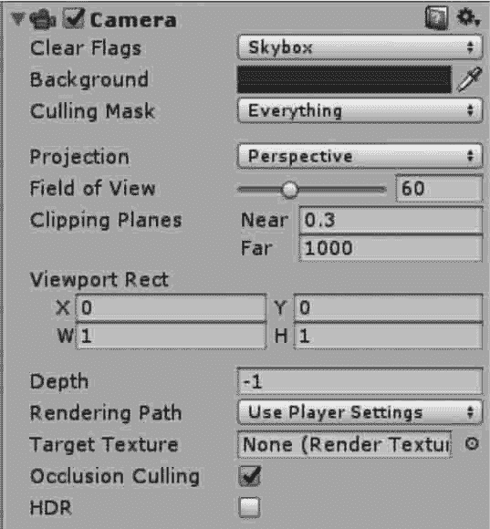

# 如何在 Unity 3D 中编写脚本？

> 原文：[`c.biancheng.net/view/2681.html`](http://c.biancheng.net/view/2681.html)

在上一节我们介绍了 Unity 3D 脚本的基本语法及注意事项，接下啦我们来讲解一下如何在 Unity 3D 中编写一个脚本。

## 创建脚本

首先执行 Assets→Create→C#Script 或 JavaScript 菜单命令创建一个空白脚本，将其命名为 Move，这里我们以 C# Script 为例如下图所示。


在 Project 面板中双击 Move 打开脚本，进行脚本编写。在 Update() 函数中插入代码，函数内的每一帧代码都会执行，代码如下：

```

using UnityEngine;
using System.Collections;
public class Move:MonoBehaviour{
    void Update(){
        transform.Translate(Input.GetAxis("Horizontal"), 0, Input.GetAxis("Vertical"));
    }
}
```

Input.GetAxis() 函数返回 -1～1 的值，在水平轴上，左方向键对应 -1，右方向键对应 1。由于目前不需要向上移动摄像机，所以 Y 轴的参数为 0。

执行 Edit→Project Settings→Input（输入）菜单命令，即可修改映射到水平方向和垂直方向的名称和快捷键，如下图所示。


## 链接脚本

脚本创建完成后，需要将其添加到物体上。在 Hierarchy 视图中，单击需要添加脚本的游戏物体 Main Camera（主摄像机），然后执行 Component→Script→Move 菜单命令，如下图所示，Move 脚本就链接到了 Main Camera 上。


摄像机（Camera）是向玩家捕获和显示世界的设备。通过自定义和操纵摄像机，可以自由旋转游戏视角。场景中摄像机的数量不受限制，它们可以以任何顺序放置在屏幕上的任何地方，或者只捕获屏幕的某些部分。摄像机参数如下图和下表所示。



| 参 数 | 含 义 | 功 能 |
| Clear Flags | 清除标识 | 确定屏幕哪些部分将被清除。这是为了方便使用多个摄像机捕 捉不同的游戏元素 |
| Background | 背景 | 在完成了视图中的所有元素的绘制后以及没有天空盒的情况 下，剩余屏幕的颜色 |
| Culling Mask | 消隐遮罩 | 包含层或忽略层将被摄像机渲染。在检视窗口向对象分配层 |
| Projection | 投影 | 切换摄像机以模拟透视 |
| Perspective | 透视 | 透视摄像机，由原点向外扩散性发射。即，距离越远，它的视口 区域也就越大，透视视图和人眼的视觉感受是一致的 |
| Orthographic | 正交 | 正交摄像机，无论远近，它的视口范围永远是固定的，相机会均 匀地渲染物体，没有透视感 |
| Size | 大小 | 当摄像机设置为正交模式时，摄影机视口的大小 |
| Field of view | 视野 | 摄像机的视野，沿着本地 Y 轴测量，以度为单位 |
| Clipping Planes | 裁剪面 | 摄像机从开始到结束渲染的距离 |
| Near | 近 | 相对于摄像机，绘制将发生的最近点 |
| Far | 远 | 相对于摄像机，绘制将发生的最远点 |
| Viewport Rect | 视口矩形 | 摄像机画面显示在屏幕上的区域 |
| X |   | 摄像机视图的开始水平位置 |
| Y |   | 摄像机视图的开始垂直位置 |
| W | 宽度 | 摄像机输出在屏幕上的宽度 |
| H | 高度 | 摄像机输出在屏幕上的高度 |
| Depth | 深度 | 摄像机在渲染顺序上的位置。具有较低深度的摄像机将在较高 深度的摄像机之前渲染 |
| Rendering Path | 渲染路径 | 定义摄像机的渲染路径 |
| Target Texture | 目标纹理 | 用于将摄像机视图输出并渲染到屏幕，一般用于制作导航图或 者画中画等效果 |
| Occlusion Culling | 遮挡剔除 | 指定是否剔除物体背向摄像机的部分 |
| HDR | 高动态光照渲染 | 启用摄像机的高动态范围渲染功能 |

## 运行测试

单击播放按钮，在 Scene 视图中，使用键盘上的 W（前）、S（后）、A（左）、D（右）键移动摄像机，运行效果如下图所示。


 

## C#脚本编写注意事项

在 Unity 3D 中，C# 脚本的运行环境使用了 Mono 技术，Mono 是指 Novell 公司致力于 .NET 开源的工程，利用 Mono 技术可以在 Unity 3D 脚本中使用 .NET 所有的相关类。

但 Unity 3D 中 C# 的使用与传统的 C# 有一些不同。

#### 1) 脚本中的类都继承自 MonoBehaviour 类

Unity 3D 中所有挂载到游戏对象上的脚本中包含的类都继承自 MonoBehaviour 类。

MonoBehaviour 类中定义了各种回调方法，例如 Start、Update 和 FixedUpdate 等。

通过在 Unity 中创建 C# 脚本，系统模板已经包含了必要的定义，如图下图所示。


#### 2) 使用 Awake 或 Start 方法初始化

用于初始化的 C# 脚本代码必须置于 Awake 或 Start 方法中。

Awake 和 Start 的不同之处在于：Awake 方法是在加载场景时运行，Start 方法是在第一次调用 Update 或 FixedUpdate 方法之前调用，Awake 方法在所有 Start 方法之前运行。

#### 3) 类名必须匹配文件名

C# 脚本中类名必须和文件名相同，否则当脚本挂载到游戏对象时，控制台会报错。

#### 4) 只有满足特定情况时变量才能显示在属性查看器中

只有公有的成员变量才能显示在属性查看器中，而 private 和 protected 类型的成员变量不能显示，如果要使属性项在属性查看器中显示，它必须是 public 类型的。

#### 5) 尽量避免使用构造函数

不要在构造函数中初始化任何变量，而应使用 Awake 或 Start 方法来实现。

在单一模式下使用构造函数可能会导致严重后果，因为它把普通类构造函数封装了，主要用于初始化脚本和内部变量值，这种初始化具有随机性，容易引发引用异常。因此，一般情况下尽量避免使用构造函数。