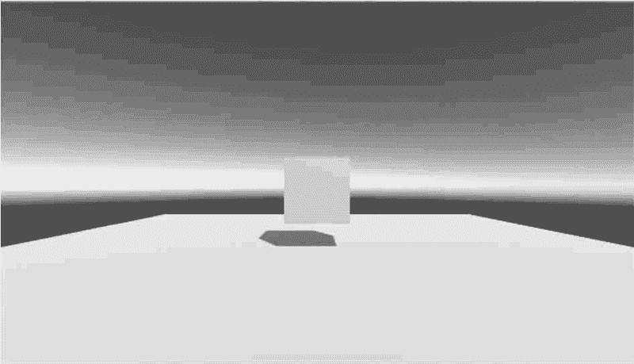
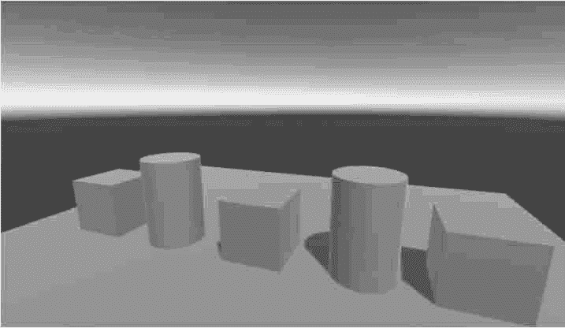

# Unity 3D 脚本应用实例演示（三个实例）

> 原文：[`c.biancheng.net/view/2685.html`](http://c.biancheng.net/view/2685.html)

在我们学会如何编写一个 Unity 3D 脚本之后，要怎么应用这些脚本呢，接下来我们以案例的形式带大家了解一下游戏开发中 Unity 3D 脚本的应用。

## 实践案例：创建游戏对象

### 案例构思

游戏场景中出现的所有物体都属于游戏对象，游戏对象之间的交互都可以通过脚本来控制并实现。

创建游戏对象的方法有 3 种：

*   第一种是将物体模型资源由 Project 视图直接拖曳到 Hierarchy 面板中；
*   第二种是在 Unity 3D 菜单 GameObject 中创建 Unity 3D 自带的游戏对象，如 Cube、Camera、Light 等；
*   第三种是利用脚本编程，动态创建或删除游戏对象。

本实践案例采用第三种方法，即利用脚本动态创建游戏对象。

利用脚本动态创建游戏对象的方法又分为两种：

*   使用 CreatePrimitive 方法创建 Unity 3D 系统自带的基本游戏对象；
*   使用 Instantiate 实例化方法将预制体实例化为对象。


### 案例设计

本案例通过 C# 脚本在 Unity 3D 内创建一个 Cube 模型和一个 Sphere 模型，通过屏幕左上方按钮控制 Cube 和 Sphere 模型创建，如下图所示。


### 案例实施

步骤 1)：使用 CreatePrimitive 方法创建 Unity 3D 系统自带的基本游戏对象，创建脚本输入代码。

```

using UnityEngine;
using System.Collections;
public class CreatePrimitive:MonoBehaviour{
    OnGUI(){
        if(GUILayout.Button("CreateCube", GUILayout.Height(50))){
            GameObject m_cube=GameObject.CreatePrimitive(PrimitiveType.Cube);
            m_cube.AddComponent<Rigidbody>();
            m_cube.GetComponent<Renderer>().material.color=Color.blue;
            m_cube.transform.position=new Vector3(0, 10, 0);
        }
        if(GUILayout.Button("CreateSphere", GUILayout.Height(50))){
            GameObject m_cube=GameObject.CreatePrimitive(PrimitiveType.Sphere);
            m_cube.AddComponent<Rigidbody>();
            m_cube.GetComponent<Renderer>().material.color=Color.red;
            m_cube.transform.position=new Vector3(0, 10, 0);
        }
    }
}
```

在上述 OnGUI() 函数中，单击 CreateCube 按钮或 CreateSphere 按钮后，将分别调用 CreatePrimitive 方法，从而创建 Cube 和 Sphere 游戏对象，并且为这两个游戏对象添加刚体、颜色以及位置属性，运行效果如下图所示。


步骤 2)：使用 Instantiate 实例化方法将预制体实例化为对象。

当制作好了游戏组件（场景中的任意一个 GameObject）后，将它制作成一个组件模板，用于批量的套用工作，例如场景中“重复”的东西——“敌人”“士兵”“子弹”……称为预制体。

默认生成的预制体其实就像克隆体，其内储存着一个游戏对象，包括游戏对象的所有组件及其下的所有子游戏对象。

#### 创建预制体

首先在场景中创建一个立方体，然后在 Project 面板中单击 Create 菜单的下拉三角，在出现的对话框中选择 Prefab 创建一个预制体，并为其命名为 MyCube，如下图所示。

然后在 Hierarchy 视图中将立方体拖曳至 Project 视图中的 MyCube，完成预制体的制作并与立方体 Cube 关联。在 Hierarchy 视图中与预制体关联的游戏对象为蓝色，如下图所示。


#### 预制体实例化

将预制体复制一份到场景里的过程叫实例化，在 Project 面板中将预制体拖曳到 Inspector 面板中可以实例化一个对象。

预制体的实例化不是普通的复制，预制体实例化后产生的新游戏对象依然保持着与预制体的关联，也就是预制体进行添加组件、修改组件属性等改变，预制体实例化产生的游戏对象也会发生相应的改变。

```

if(Input.GetButtonDown("Fire1")){
    Instantiate(newObject, transform.position, transform.rotation);
}
```

上述代码中调用 Instantiate 方法实例化游戏对象与调用 CreatePrimitive 方法创建游戏对象的最终结果是完全一样的，实例化游戏对象会将对象的脚本及所有继承关系实例化到游戏场景中。

Instantiate 实例化方法比创建物体的 CreatePrimitive 方法执行效率要高很多。

在开发过程中通常会使用 Instantiate 方法实例化对象，Instantiate 方法调用时一般与预制体 Prefab 结合使用。

## 实践案例：旋转的立方体

#### 案例构思

在脚本编写中经常用到移动、旋转、缩放功能，可以使用 transform.Translate()、transform.Rotate() 和 transform.localScale 方法实现。

本案例旨在通过一个立方体让读者掌握脚本编译中移动、旋转、缩放的函数编写以及与 OnGUI 函数交互功能的实现。

#### 案例设计

本案例计划通过 C# 脚本在 Unity 内创建一个简单的 Cube 模型，采用 OnGUI 方法写 3 个交互按钮，实现与 Cube 模型进行移动、旋转、缩放的交互功能，如下图所示。


#### 案例实施

步骤 1)：为游戏项目里的游戏场景添加两个游戏对象：Cube 和 Directional，前者是脚本要操作的游戏对象，后者是负责游戏场景照明的游戏对象。

然后创建一个 Plane 位于 Cube 下方。调整游戏场景中 3 个游戏对象的位置，使得 Game 视图达到最佳的效果，如下图所示。

步骤 2)：在 Project 视图里，新建一个 C# 脚本，命名为 MyScript，打开此脚本并添加下面的代码：

```

using UnityEngine;
using System.Collections;
public class MyScript:MonoBehaviour
{
    //声明 4 个变量
    public GameObject myCube;
    public int transSpeed=100;
    public float rotaSpeed=10.5f;
    public float scale=3;
    void OnGUI(){
        if(GUILayout.Button("移动立方体")){
            myCube.transform.Translate(Vector3.forward*transSpeed*Time.deltaTime, Space.World);
        }
        if(GUILayout.Button("旋转立方体")){
            myCube.transform.Rotate(Vector3.up*rotaSpeed, Space.World);
        }
        if(GUILayout.Button("缩放立方体")){
            myCube.transform.localScale=new Vector3(scale, scale, scale);
        }
    }
}
```

脚本声明了 4 个变量，且都使用 public 修饰，所以它们可以作为属性出现在组件下。

OnGUI() 函数用于在界面中显示按钮，玩家可以通过单击按钮实现与立方体的交互功能。

步骤 3)：将脚本 MyScript 赋予 Main Camera。

步骤 4)：运行游戏，在 Game 视图的左上角会出现 3 个按钮：“移动立方体”“旋转立方体”和“缩放立方体”。单击按钮，即可完成对立方体对象的指定操作，如下图所示。


## 综合案例：第一人称漫游

#### 案例构思

虚拟漫游可以提升游戏玩家的沉浸感，Unity 3D 中提供了第一人称以及第三人称虚拟漫游的组件。

如何编写一段脚本实现虚拟漫游功能呢？本案例旨在通过脚本实现第一人称虚拟漫游功能，让读者深入掌握编写 Unity 3D 脚本实现游戏功能的方法。

#### 案例设计

本案例在场景内摆放一些基本几何体，构建简单的 3D 场景，采用 C# 脚本开发第一人称虚拟漫游功能，通过键盘 W、S、A、D 键在场景内自由行走，通过鼠标实现观察者视角的旋转功能，如下图所示。


#### 案例实施

步骤 1)：执行 GameObject→3D Object→Plane 命令创建一个平面。

步骤 2)：执行 GameObject→Create Empty 命令创建空物体，并将标签设为 Player。


一个标签是用来索引一个或一组游戏对象的词。标签是为了编程的目的而对游戏对象的标注，游戏开发人员可以使用标签来书写脚本代码，通过搜索找到包含想要的标签的对象。

添加标签方法很简单，选中 Inspector 面板右上方的 Tag，点击 Add Tag 将在检视面板打开标签管理器，然后在里面输入 Player，如上图所示。

然后再次选择空物体，在 Tag 的下拉列表中找到 Player 标签，完成添加标签，如下图所示。


步骤 3)：为主角添加角色控制器组件。执行 Component→Physics→Character Controller 命令，如下图所示。

角色控制器主要用于第三人称或第一人称游戏主角控制，并不使用刚体物理效果，具体参数如下表所示。


| 参 数 | 含 义 | 功 能 |
| Slope Limit | 坡度限制 | 限制碰撞器只能爬小于等于该值的斜坡 |
| Step Offset | 台阶高度 | 角色可以迈上的最高台阶高度 |
| Skin Width | 皮肤厚度 | 皮肤厚度决定了两个碰撞器可以互相渗人的深度 |
| Min Move Distance | 最小移动距离 | 如果角色移动的距离小于该值，角色就不会移动 |
| Center | 中心 | 该值决定胶囊碰撞器在世界空间中的位置 |
| Radius | 半径 | 胶囊碰撞器的横截面半径 |
| Height | 高度 | 胶囊碰撞器的高度 |

步骤 4)：添加 Rigidbody 组件，取消选中 Use Gravity 复选框，选中 Is Kinematic 复选框使其不受物理影响，而是受脚本控制，如下图所示。


步骤 5)：调整 Character Controller 的位置和大小，使其置于平面之上。

步骤 6)：创建 C# 脚本，将其命名为 Player。

步骤 7)：输入如下代码：

```

using UnityEngine;
using System.Collections;
public class Player:MonoBehaviour{
    public Transform m_transform;
    //角色控制器组件
    CharacterController m_ch;
    //角色移动速度
    float m_movSpeed=3.0f;
    //重力
    float m_gravity=2.0f;
    void Start(){
        m_transform=this.transform;
        //获取角色控制器组件
        m_ch=this.GetComponent<CharacterController>();
    }
    void Update(){
        Control();
    }
    void Control(){
        //定义 3 个值控制移动
        float xm=0, ym=0, zm=0;
        //重力运动
        ym-=m_gravity*Time.deltaTime;
        //前后左右移动
        if(Input.GetKey(KeyCode.W)){
            zm+=m_movSpeed*Time.deltaTime;
        }else if(Input.GetKey(KeyCode.S)){
            zm-=m_movSpeed*Time.deltaTime;
        }
        if(Input.GetKey(KeyCode.A)){
            xm-=m_movSpeed*Time.deltaTime;
        }else if(Input.GetKey(KeyCode.D)){
            xm+=m_movSpeed*Time.deltaTime;
        }
        //使用角色控制器提供的 Move 函数进行移动
        m_ch.Move(m_transform.TransformDirection(new Vector3(xm, ym, zm)));
    }
}
```

上述代码主要是控制角色前后左右移动。

在 Start 函数中，首先获取 CharacterController 组件，然后在 Control 函数中通过键盘操作获得 X 和 Y 方向上的移动距离，最后使用 CharacterController 组件提供的 Move 函数移动角色。

使用 CharacterController 提供的功能进行移动时，会自动计算移动体与场景之间的碰撞。

步骤 8)：在 Hierarchy 视图中选中 Player 游戏对象，在其 Inspector 属性面板中选择 Component→Script，选择 Player 脚本将其链接到 Player 游戏对象上，如下图所示。


步骤 9)：此时运行测试，按 W、S、A、D 键可以控制主角前后左右移动，但是在 Game 视图中却观察不到主角在场景中移动的效果，这是因为摄像机还没有与主角的游戏对象关联起来，需要添加摄像机代码。打开 Player.cs，添加如下代码：

```

//摄像机 Transform
Transform m_camTransform;
//摄像机旋转角度
Vector3 m_camRot;
//摄像机高度
float m_camHeight=1.4f;
//修改 Start 函数, 初始化摄像机的位置和旋转角度
void Start(){
    m_transform=this.transform;
    //获取角色控制器组件
    m_ch=this.GetComponent<CharacterController>();
    //获取摄像机
    m_camTransform=Camera.main.transform;
    Vector3 pos=m_transform.position;
    pos.y+=m_camHeight;
    m_camTransform.position=pos;
    //设置摄像机的旋转方向与主角一致
    m_camTransform.rotation=m_transform.rotation;
    m_camRot=m_camTransform.eulerAngles;
    //锁定鼠标
    Screen.lockCursor=true;
}
void Update(){
    Control();
}
void Control(){
    //获取鼠标移动距离
    float rh=Input.GetAxis("Mouse X");
    float rv=Input.GetAxis("Mouse Y");
    //旋转摄像机
    m_camRot.x-=rv;
    m_camRot.y+=rh;
    m_camTransform.eulerAngles=m_camRot;
    //使角色的面向方向与摄像机一致
    Vector3 camrot=m_camTransform.eulerAngles;
    camrot.x=0;camrot.z=0;
    m_transform.eulerAngles=camrot;
    //操作角色移动代码
    //使摄像机位置与角色一致
    Vector3 pos=m_transform.position;
    pos.y+=m_camHeight;
    m_camTransform.position=pos;
}
```

上述代码通过控制鼠标旋转摄像机方向，使角色跟随摄像机的 Y 轴旋转方向，在移动角色时，使摄像机跟随角色运动。

步骤 10)：单击 Play 按钮进行测试，效果如下图所示，通过鼠标操作可以在场景中旋转视角，通过 W、S、A、D 键可以在场景中向前、向后、向左、向右移动。


