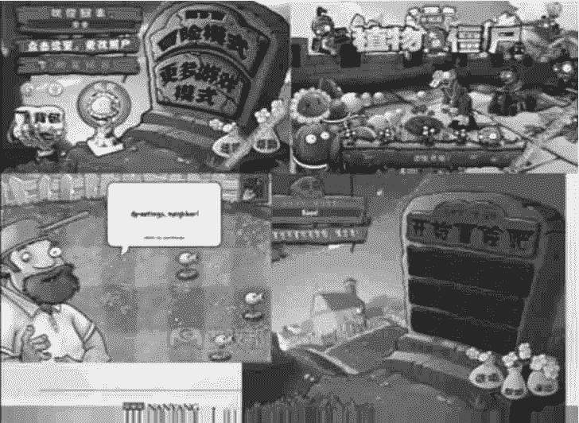
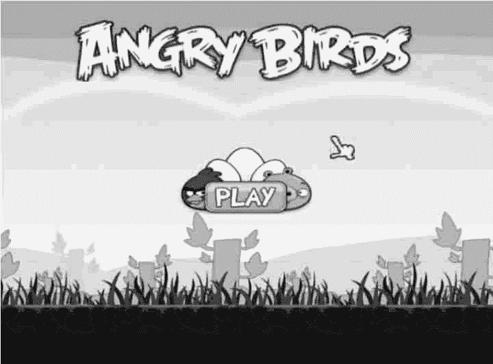
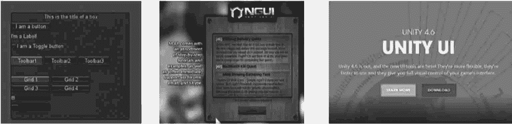

# Unity 3D GUI 简介

> 原文：[`c.biancheng.net/view/2686.html`](http://c.biancheng.net/view/2686.html)

在游戏开发过程中，为了增强游戏与玩家的交互性，开发人员往往会通过制作大量的图形用户界面（Graphical User Interface，GUI）来增强这一效果。

Unity 3D 中的图形系统分为 OnGUI、NGUI、UGUI 等，这些类型的图形系统内容十分丰富，包含游戏中通常使用到的按钮、图片、文本等控件。

## GUI 的概念

图形用户界面是指采用图形方式显示的计算机用户操作界面。

与早期计算机使用的命令行界面相比，图形界面对于用户来说在视觉上更易于接受，可以使玩家更好地了解游戏。

《植物大战僵尸》和《愤怒的小鸟》中的 GUI 如下图所示。

## GUI 的发展

在游戏开发的整个过程中，游戏界面占据了非常重要的地位。

玩家在启动游戏的时候，首先看到的就是游戏的 GUI，其中包括贴图、按钮和高级控件等。

早期的 Unity 3D 采用的是 OnGUI 系统，后来进展到了 NGUI 系统。

在 Unity 4.6 以后 Unity 官方推出了新的 UGUI 系统，采用全新的独立坐标系，为游戏开发者提供了更高的运转效率。各个时期的 Unity GUI 如下图所示。

