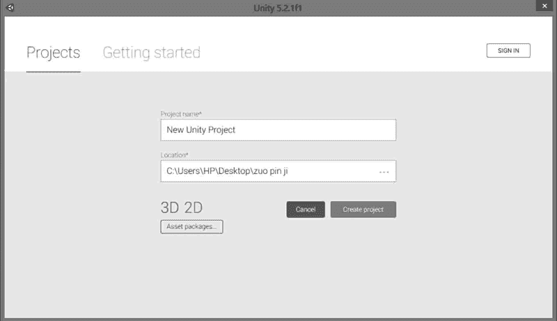
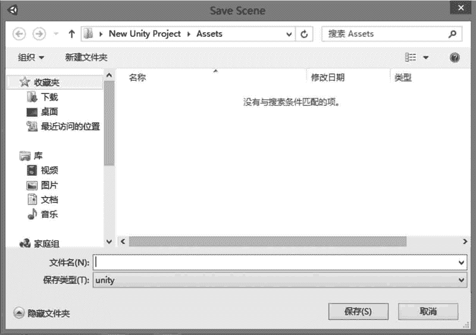
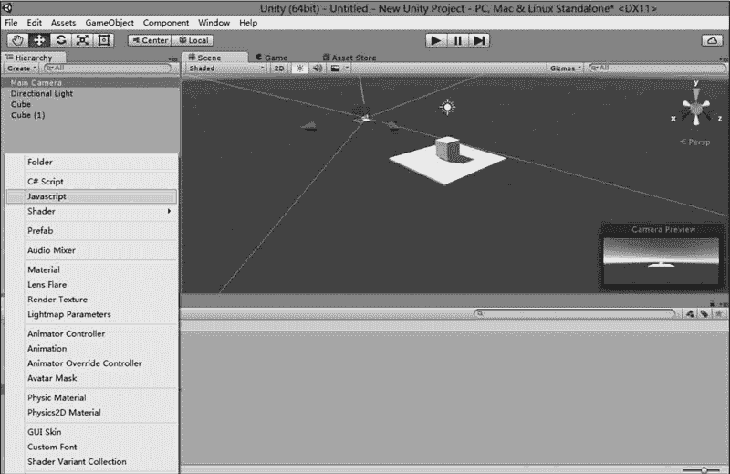
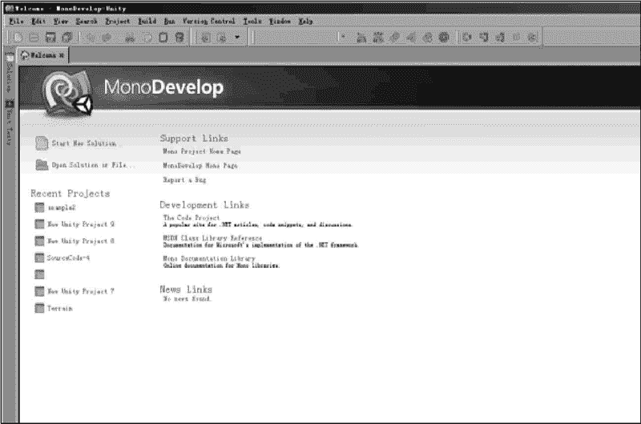
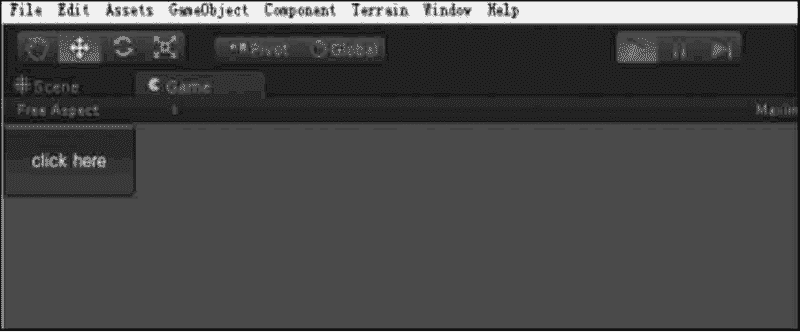
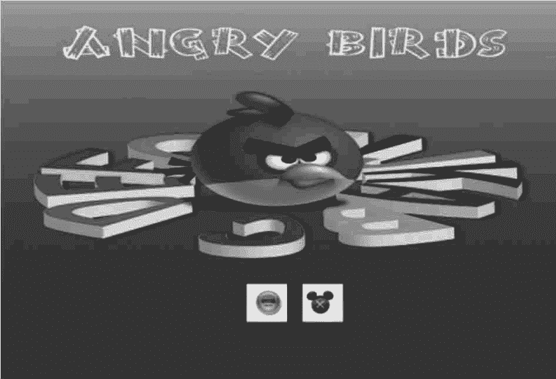

# Unity 3D Button 控件

> 原文：[`c.biancheng.net/view/2689.html`](http://c.biancheng.net/view/2689.html)

在 Unity 3D 开发中 Button 控件是游戏开发中最常使用的控件之一，用户常常通过 Button 控件来确定其选择行为，当用户单击 Button 控件时，Button 控件会显示按下的效果，并触发与该控件关联的游戏功能。

在游戏中通常用作游戏界面、游戏功能、游戏设置的开关。

一般来说，按钮分两种：普通按钮和图片按钮。

## 普通按钮

普通按钮是系统默认显示的按钮，Unity 3D 的普通按钮背景呈半透明状态，显示白色文字，普通按钮的使用方法如下：

```

public static function Button(position:Rect, text:string):bool;
public static function Button(position:Rect, image:Texture):bool;
public static function Button(position:Rect, content:GUIContent):bool;
public static function Button(position:Rect, text:string, style:GUIStyle):bool;
public static function Button(position:Rect, image:Texture, style:GUIStyle):bool;
public static function Button(position:Rect, content:GUIContent, style:GUIStyle):bool;
```

其中，position 指按钮在屏幕上的位置以及长宽值，text 指按钮上显示的文本。

Button 控件的参数如下表所示。

| 参 数 | 功 能 | 参 数 | 功 能 |
| position | 设置控件在屏幕上的位置及大小 | text | 设置控件上显示的文本 |
| image | 设置控件上显示的纹理图片 | content | 设置控件的文本、图片和提示 |
| style | 设置控件使用的样式 |   |   |

下面是 Button 控件的使用案例：

#### 1) 启动 Unity 3D

创建新项目，将其命名为 button text，单击 Create 按钮，即生成一个新项目，如下图所示。



#### 2) 在菜单中执行 File→Save Scene 命令

保存当前场景，命名为 scene，即在 Unity 3D 中创建了一个游戏场景，如下图所示。



#### 3) 创建 JavaScript 脚本

单击 Project 视图中 Create 右侧的下拉三角形，选择 JavaScript，即可创建 JavaScript 脚本，如下图所示。



#### 4) 打开脚本编辑器

在 Project 面板中双击该脚本文件，打开脚本编辑器，如下图所示。



##### 5) 输入下列脚本语句

```

function OnGUI(){
    if(GUI.Button(Rect(0, 0, 100, 50), "click here")){
        print("you have click here!");
    }
}
```

#### 6) 保存脚本（Ctrl+S 键）

#### 7) 将脚本与主摄像机相连

将脚本拖动到 Hierarchy 视图中的 Main Camera 对象上，这时脚本与场景中的摄像机产生了关联。

#### 8) 测试脚本

单击 Unity 3D 工具栏上的运行按钮对脚本进行测试，如下图所示，在 Game 视图中出现了一个按钮，按钮上显示 click here，单击该按钮，在 Unity 3D 主界面底部的状态栏上输出 You have click here。



## 图片按钮

Button 控件除了可以显示文字以外，还可以显示贴图。

贴图是一种美化按钮的方法，开发者可以设定按钮的背景图片，比如水晶按钮、卡通按钮等。

在 Unity 3D 中实现 Button 贴图十分容易，只要将图片作为一个参数传递到 Button 函数中即可。

Button 贴图方法如下：

```

public static function Button(position:Rect, image:Texture):bool;
public static function Button(position:Rect, image:Texture, style:GUIStyle):bool;
```

其中 position 为按钮在屏幕上的位置以及长宽值，image 为按钮上显示的图片。

下面是 Button 贴图的使用案例。

步骤 1)：启动 Unity 3D 创建新项目，将其命名为 button。

步骤 2)：在菜单中执行 File→Save Scene 命令，保存当前场景，命名为 scene，即在 Unity 3D 中创建了一个游戏场景。

步骤 3)：单击 Project 视图中 create 右侧的下拉三角形，选择 JavaScript，创建 JavaScript 脚本。

步骤 4)：在 Project 视图中双击该脚本文件，打开脚本编辑器，输入下列脚本语句：

```

var btnTexture:Texture;
var atnTexture:Texture;
function OnGUI(){
    if(!btnTexture){
        Debug.LogError("Please assign a texture on the inspector");
        return;
    }
    if(!atnTexture){
        Debug.LogError("Please assign a texture on the inspector");
        return;
    }
    if(GUI.Button(Rect(Screen.width/2-50, Screen.height/2+130, 70, 70),atnTexture)){
        Application.LoadLevel("play");
    }
    if(GUI.Button(Rect(Screen.width/2+30, Screen.height/2+130, 70, 70),btnTexture)){
        Application.LoadLevel("exit");
    }
}
```

步骤 5)：保存脚本（Ctrl+S 键）。

步骤 6)：将脚本与主摄像机相连。

步骤 7)：单击主摄像机，在 Inspector 属性面板中添加纹理图片。

步骤 8)：单击 play 按钮测试效果，可以看见按钮已经换成了二维卡通图片的形式，如下图所示。

