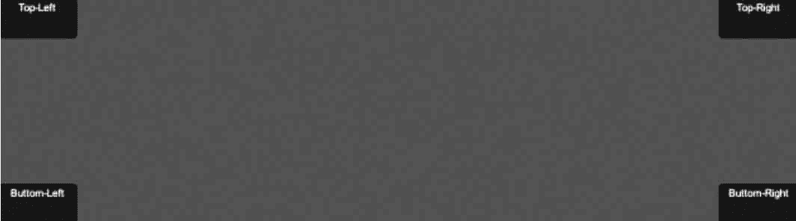

# Unity 3D Box 控件

> 原文：[`c.biancheng.net/view/2691.html`](http://c.biancheng.net/view/2691.html)

Unity 3D Box 控件用于在屏幕上绘制一个图形化的盒子。

Box 控件中既可以显示文本内容，也可以绘制图片，或两者同时存在。

GUIContent 和 GUIStyle 对于 Box 控件同样适用，既可以用来修饰 Box 控件的文本颜色，也可以用来修饰文本大小、图片资源等，具体使用方法如下：

```

public static function Box(position:Rect, text:string):void;
public static function Box(position:Rect, image:Texture):void;
public static function Box(position:Rect, content:GUIContent):void;
public static function Box(position:Rect, text:string, style:GUIStyle):void;
public static function Box(position:Rect, image:Texture, style:GUIStyle):void;
public static function Box(position:Rect, content:GUIContent, style:GUIStyle):void;
```

其中，position 为矩形区域的位置，text 为显示的文本信息，texture 为纹理（即图片）显示。

Box 控件的具体属性参数如下表所示。

| 参 数 | 功 能 | 参 数 | 功 能 |
| position | 设置控件在屏幕上的位置及大小 | text | 设置控件上显示的文本 |
| image | 设置控件上显示的纹理图片 | content | 设置控件的文本、图片和提示 |
| style | 设置控件使用的样式 |   |   |

下面是 Box 控件的使用案例。

步骤 1)：创建项目，将其命名为 box，保存场景。

步骤 2)：在 Unity 3D 菜单栏中执行 Assets→Create→JavaScript 命令，创建一个新的脚本文件。

步骤 3)：在 Project 视图中双击该脚本文件，打开脚本编辑器，输入下列语句：

```

function OnGUI(){
    GUI.Box(Rect(0, 0, 100, 50), "Top-Left");
    GUI.Box(Rect(Screen.width-100, 0, 100, 50), "Top-Right");
    GUI.Box(Rect(0, Screen.height-50, 100, 50), "Buttom-Left");
    GUI.Box(Rect(Screen.width-100, Screen.height-50, 100, 50), "Buttom-Right");
}
```

步骤 4)：按 Ctrl+S 键保存脚本。

步骤 5)：在 Project 视图中选择脚本，将其连接到 Main Camera 上。

步骤 6)：单击 Play 按钮进行测试，Game 视图的 4 个角出现了 4 个标题分别为 Top-Left、Top-Right、Bottom-Left、Bottom-Right 的按钮组件，如下图所示。

