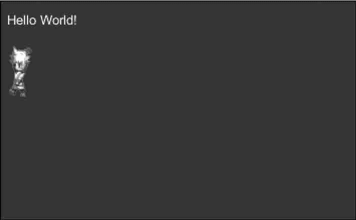

# Unity 3D Label 控件

> 原文：[`c.biancheng.net/view/2692.html`](http://c.biancheng.net/view/2692.html)

Unity 3D Label 控件用于在设备的屏幕上创建文本标签和纹理标签，和 Box 控件类似，可以显示文本内容或图片。

Label 控件一般用于显示提示性的信息，如当前窗口的名称、游戏中游戏对象的名字、游戏对玩家的任务提示和功能介绍等，具体使用方法如下：

```

public static function Label(position:Rect, text:string):void;
public static function Label(position:Rect, image:Texture):void;
public static function Label(position:Rect, content:GUIContent):void;
public static function Label(position:Rect, text:string, style:GUIStyle):void;
public static function Label(position:Rect, image:Texture, style:GUIStyle):void;
public static function Label(position:Rect, content:GUIContent, style:GUIStyle):void;
```

其中，position 为 Label 显示的位置，text 为 Label 上显示的文本，image 为 Label 上显示的纹理图片。

Label 控件的具体参数如下表所示。

| 参 数 | 功 能 | 参 数 | 功 能 |
| position | 设置控件在屏幕上的位置及大小 | text | 设置控件上显示的文本 |
| image | 设置控件上显示的纹理图片 | content | 设置控件的文本、图片和提示 |
| style | 设置控件使用的样式 |   |   |

下面是 Label 控件的使用案例。

步骤 1)：创建项目，将其命名为 Label，保存场景。

步骤 2)：在 Unity 3D 菜单栏中执行 Assets→Create→JavaScript 命令，创建一个新的脚本文件。

步骤 3)：在 Project 视图中双击该脚本文件，打开脚本编辑器，输入下列语句：

```

var textureToDisplay:Texture2D;
function OnGUI(){
    GUI.Label(Rect(10, 10, 100, 20), "Hello World!");
    GUI.Label(Rect(10, 40, textureToDisplay.width, textureToDisplay.height),textureToDisplay);
}
```

步骤 4)：按 Ctrl+S 键保存脚本。

步骤 5)：在 Project 视图中选择脚本，将其连接到 Main Camera。

步骤 6)：单击主摄像机，在 Inspector 属性面板中添加纹理图片。

步骤 7)：单击 Play 按钮进行测试，如下图所示，界面上出现一串文字以及贴图。

