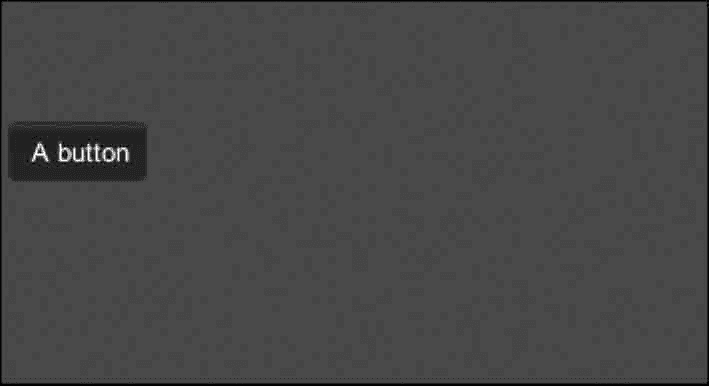

# Unity 3D Background Color 控件

> 原文：[`c.biancheng.net/view/2693.html`](http://c.biancheng.net/view/2693.html)

Unity 3D Background Color 控件主要用于渲染 GUI 的背景。

例如，要绘制一个按钮，希望按钮的背景呈现出红色，可以使用 BackgroundColor 来实现，使用时要对其作如下定义：

```

public static var backgroundColor:Color;
```

其中 Color 为 GUI 背景的渲染颜色。

下面是 GUI.Background Color 控件的使用案例。

步骤 1)：创建项目，将其命名为 backgroundcolor，保存场景。

步骤 2)：在 Unity 3D 菜单栏中执行 Assets→Create→JavaScript 命令，创建一个新的脚本文件。

步骤 3)：在 Project 视图中双击该脚本文件，打开脚本编辑器，输入下列语句：

```

function OnGUI(){
    GUI.backgroundColor=Color.red;
    GUI.Button(Rect(10, 110, 70, 30), "A button");
}
```

步骤 4)：按 Ctrl+S 键保存脚本。

步骤 5)：在 Project 视图中选择脚本，将其连接到 Main Camera 上。

步骤 6)：单击运行按钮进行测试，效果如下图所示，绘制的按钮由于背景颜色的设定而呈现红色。

