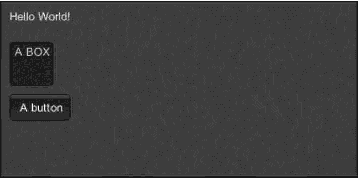

# Unity 3D Color 控件

> 原文：[`c.biancheng.net/view/2694.html`](http://c.biancheng.net/view/2694.html)

Unity 3D Color 控件与 Background Color 控件类似，都是渲染 GUI 颜色的，但是两者不同的是 Color 不但会渲染 GUI 的背景颜色，同时还会影响 GUI.Text 的颜色。

具体使用时，要作如下定义：

```

public static var color:Color;
```

其中，Color 为渲染颜色。

下面是 Color 控件的使用案例。

步骤 1)：创建项目，将其命名为 GUI.Color，保存场景。

步骤 2)：在 Unity 3D 菜单栏中执行 Assets→Create→JavaScript 命令，创建一个新的脚本文件。

步骤 3)：在 Project 视图中双击该脚本文件，打开脚本编辑器，输入下列语句：

```

function OnGUI(){
    GUI.Color=Color.yellow;
    GUI.Label(Rect(10, 10, 100, 20), "Hello World!");
    GUI.Box(Rect(10, 50, 50, 50), "A BOX");
    GUI.Button(Rect(10, 110, 70, 30), "A button");
}
```

步骤 4)：按 Ctrl+S 键保存脚本。

步骤 5)：在 Project 视图中选择脚本，将其连接到 Main Camera 上。

步骤 6)：单击 Play 按钮进行测试，效果如下图所示，绘制的按钮背景和字体由于 GUI.Color 的设定而呈现黄色。

