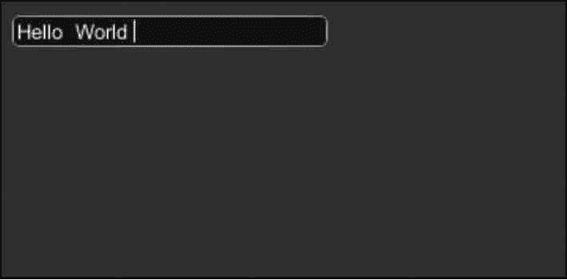

# Unity 3D TextField 控件

> 原文：[`c.biancheng.net/view/2695.html`](http://c.biancheng.net/view/2695.html)

Unity 3D TextField 控件用于绘制一个单行文本编辑框，用户可以在单行文本编辑框中输入信息，并且每当用户修改文本编辑框中的文本内容时，TextField 控件就会将当前文本编辑框中的文本信息以字符串形式返回。

开发人员可以通过创建 String 变量来接收返回值并实现相关功能。

因此 TextField 控件常常用于监听用户输入信息，比如玩家在游戏登录界面输入用户名和密码后，TextField 控件可以判断其输入是否正确，其使用方法如下：

```

public static function TextField(position:Rect, text:string):string;
public static function TextField(position:Rect, text:string, maxLength:int):string;
public static function TextField(position:Rect, text:string, style:GUIStyle):string;
public static function TextField(position:Rect, text:string, maxLength:int,style:GUIStyle):string;
```

其中，position 为显示区域，text 为字符串。

TextField 控件的具体参数如下表所示。

| 参 数 | 功 能 | 参 数 | 功 能 |
| position | 设置控件在屏幕上的位置及大小 | text | 设置控件上默认显示的文本 |
| maxLength | 设置输入的字符串的最大长度 | style | 设置控件使用的样式 |

下面是 GUI.TextField 控件的使用案例。

步骤 1)：创建项目，将其命名为 GUI.TextField，保存场景。

步骤 2)：在 Unity 3D 菜单栏中执行 Assets→Create→JavaScript 命令，创建一个新的脚本文件。

步骤 3)：在 Project 视图中双击该脚本文件，打开脚本编辑器，输入下列语句：

```

var stringToEdit:String="Hello World";
function OnGUI(){
    stringToEdit=GUI.TextField(Rect(10, 10, 200, 20), stringToEdit, 25);
}
```

步骤 4)：按 Ctrl+S 键保存脚本。

步骤 5)：在 Project 视图中选择脚本，将其连接到 Main Camera 上。

步骤 6)：单击 Play 按钮进行测试，运行效果如下图所示，界面中出现了一个文本框，可以进行文本的输入。

