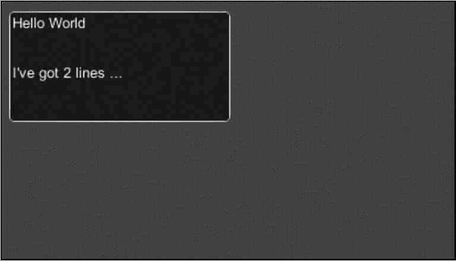

# Unity 3D TextArea 控件

> 原文：[`c.biancheng.net/view/2696.html`](http://c.biancheng.net/view/2696.html)

Unity 3D TextArea 控件用于创建一个多行的文本编辑区。用户可以在多行文本编辑区编辑文本内容，并且控件可以对超出控件宽度的文本内容实现换行操作。

TextArea 控件同样会将当前文本编辑区中的文本内容以字符串形式返回。

开发人员可以通过创建 String 变量来接收返回值并实现相关功能，具体使用方法如下：

```

public static function TextArea(position:Rect, text:string):string;
public static function TextArea(position:Rect, text:string, maxLength:int):string;
public static function TextArea(position:Rect, text:string, style:GUIStyle):string;
public static function TextArea(position:Rect, text:string, maxLength:int,style:GUIStyle):string;
```

其中，position 为显示位置，text 为字符。

TextArea 控件的参数如下表所示。

| 参 数 | 功 能 | 参 数 | 功 能 |
| position | 设置控件在屏幕上的位置及大小 | text | 设置控件上默认显示的文本 |
| maxLength | 设置输入的字符串的最大长度 | style | 设置控件使用的样式 |

下面是 GUI.TextArea 控件的使用案例。

步骤 1)：创建项目，将其命名为 GUI.TextArea，保存场景。

步骤 2)：在 Unity 3D 菜单栏中执行 Assets→Create→JavaScript 命令，创建一个新的脚本文件。

步骤 3)：在 Project 视图中双击该脚本文件，打开脚本编辑器，输入下列语句：

```

var stringToEdit:String="Hello World\nI've got 2 lines...";
function OnGUI(){
    stringToEdit=GUI.TextArea(Rect(10, 10, 200, 100), stringToEdit, 200);
}
```

步骤 4)：按 Ctrl+S 键保存脚本。

步骤 5)：在 Project 视图中选择脚本，并将其拖曳到 Hierarchy 视图中的 Main Camera 上，使脚本和摄像机产生关联。

步骤 6)：单击运行按钮进行脚本测试，如下图所示。

