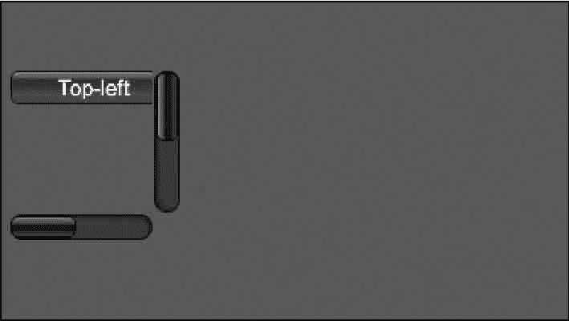

# Unity 3D ScrollView 控件

> 原文：[`c.biancheng.net/view/2697.html`](http://c.biancheng.net/view/2697.html)

当游戏界面中的内容特别多，超出了屏幕的显示范围时，就可以使用 Unity 3D ScrollView 控件滚动显示界面内的全部内容。

ScrollView 控件用于在屏幕上创建滚动视图，通过一片小区域查看较大区域的内容。当内容区域大于查看区域时，该控件就会自动生成垂直（水平）滚动条，用户可以通过拖曳滚动条来查看所有内容。

一般情况下，滚动条由两部分组成，一个是 GUI.BeginScrollView，用于开始滚动视图，另一个是 GUI.EndScrollView，用于结束滚动视图，需要滚动显示的内容就夹在其间，具体使用方法如下：

```

public static function BeginScrollView(position:Rect, scrollPosition:Vector2,viewRect:Rect):Vector2;
public static function BeginScrollView(position:Rect, scrollPosition:Vector2,viewRect:Rect, alwaysShowHorizontal:bool, alwaysShowVertical:bool,horizontalScrollbar:GUIStyle, verticalScrollbar:GUIStyle):Vector2;
public static function EndScrollView():void;
```

其中，position 为显示位置，scrollPosition 用于设置滚动条的起始位置，viewRect 用于设置滚动整体显示范围，EndScrollView 用于结束滚动视图内容。

ScrollView 控件的参数如下表所示。

| 参 数 | 功 能 | 参 数 | 功 能 |
| position | 设置控件在屏幕上的位置及 大小 | ScrollPosition | 用来显示滚动位置 |
| viewRect | 设置滚动整体显示范围 | alwaysShowHorizontal | 可选参数，总是显示水平 滚动条 |
| HorizontalScrollbar | 设置用于水平滚动条的可选 GUI 样式 | alwaysShow Vertical | 可选参数，总是显示垂直 滚动条 |
| VerticalScrollbar | 设置用于垂直滚动条的可选 GUI 样式 |   |   |

下面是 ScrollView 控件的使用案例。

步骤 1)：创建项目，将其命名为 BeginScrollView，保存场景。

步骤 2)：在 Unity 3D 菜单栏中执行 Assets→Create→JavaScript 命令，创建一个新的脚本文件。

步骤 3)：在 Project 视图中双击该脚本文件，打开脚本编辑器，输入下列语句：

```

var scrollPosition:Vector2=Vector2.zero;
function OnGUI(){
    scrollPosition=GUI.BeginScrollView(Rect(10, 300, 100, 100),
    scrollPosition, Rect(0, 0, 220, 200));
    GUI.Button(Rect(0, 0, 100, 20), "Top-left");
    GUI.Button(Rect(120, 0, 100, 20), "Top-right");
    GUI.Button(Rect(0, 180, 100, 20), "Bottom-left");
    GUI.Button(Rect(120, 180, 100, 20), "Bottom-right");
    GUI.EndScrollView();
}
```

步骤 4)：按 Ctrl+S 键保存脚本。

步骤 5)：在 Project 视图中选择脚本，将其连接到 Main Camera 上。

步骤 6)：单击 Play 按钮进行测试，效果如下图所示。

