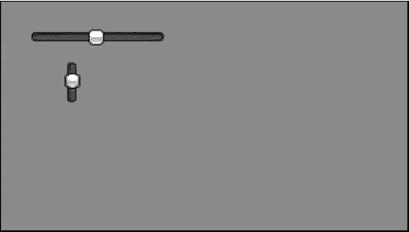

# Unity 3D Slider 控件

> 原文：[`c.biancheng.net/view/2699.html`](http://c.biancheng.net/view/2699.html)

Unity 3D Slider 控件包括两种，分别是水平滚动条 GUI.HorizontalSlider 和垂直滚动条 GUI.VerticalSlider，可以根据界面布局的需要选择使用，具体使用方法如下：

```

public static function HorizontalSlider(position:Rect, value:float, leftValue:float, rightValue:float):float;
public static function HorizontalSlider(position:Rect, value:float, leftValue:float, rightValue:float, slider:GUIStyle, thumb:GUIStyle):float;
```

其中，position 为滚动条的位置，value 为可拖动滑块的显示位置，topValue 为滑块上端所处的位置，bottomValue 为滑块下端所处位置。

Slider 控件的参数如下表所示。

| 参 数 | 功 能 | 参 数 | 功 能 |
| position | 设置控件在屏幕上的位置及大小 | value | 设置滑动条显示的值。这决定了可 拖动的滑块的位置 |
| leftValue | 设置滑块左端的值 | rightValue | 设置滑块右端的值 |
| slider | 设置用于显示拖曳区域的 GUI 样式 | thumb | 设置用于显示可拖动的滑块的 GUI 样式 |

下面是 Slider 控件的使用案例。

步骤 1)：创建项目，将其命名为 horizontalSlider，保存场景。

步骤 2)：在 Unity 3D 菜单栏中执行 Assets→Create→JavaScript 命令，创建一个新的脚本文件。

步骤 3)：在 Project 视图中双击该脚本文件，打开脚本编辑器，输入下列语句：

```

var hSliderValue:float=0.0;
var vSliderValue:float=0.0;
function OnGUI(){
    hSliderValue=GUI.HorizontalSlider(Rect(2 5, 2 5, 1 0 0, 3 0), hSliderValue, 0.0, 1 0.0);
    vSliderValue=GUI.VerticalSlider(Rect(5 0, 5 0, 1 0 0, 3 0), vSliderValue, 1 0.0, 0.0);
}
```

步骤 4)：按 Ctrl+S 键保存脚本。

步骤 5)：在 Project 视图中选择脚本，将其连接到 Main Camera 上。

步骤 6)：单击 Play 按钮进行测试，效果如下图所示。

