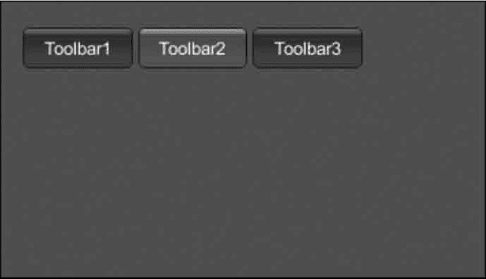

# Unity 3D ToolBar 控件

> 原文：[`c.biancheng.net/view/2700.html`](http://c.biancheng.net/view/2700.html)

Unity 3D ToolBar 控件主要用于创建工具栏，具体使用方法如下：

```

public static function Toolbar(position:Rect, selected:int, texts:string[]):int;
public static function Toolbar(position:Rect, selected:int, images:Texture[]):int;
public static function Toolbar(position:Rect, selected:int, content:GUIContent[]):int;
public static function Toolbar(position:Rect, selected:int, texts:string[],style:GUIStyle):int;
public static function Toolbar(position:Rect, selected:int, images:Texture[],style:GUIStyle):int;
public static function Toolbar(position:Rect, selected:int, contents:GUIContent[], style:GUIStyle):int;
```

其中，position 为 ToolBar 的显示区域，selected 为选中菜单的索引号，texts 为菜单显示内容。

ToolBar 控件的参数如下表所示。

| 参 数 | 功 能 | 参 数 | 功 能 |
| position | 设置控件在屏幕上的位置及大小 | selected | 选择按钮的索引 |
| texts | 设置在工具栏按钮上显示的一组 字符串 | images | 在工具栏按钮上显示的一组纹理 |
| contents | 在工具栏按钮上显示的一组文本、 图像和工具提示 | style | 要使用的样式。如果省略，则使用 当前 GUISkin 的按钮样式 |

下面是 ToolBar 控件的使用案例。

步骤 1)：创建项目，将其命名为 GUI.Toolbar，保存场景。

步骤 2)：在 Unity 菜单栏中执行 Assets→Create→JavaScript 命令，创建一个新的脚本文件。

步骤 3)：在 Project 视图中双击该脚本文件，打开脚本编辑器，输入下列语句：

```

var toolbarInt:int=0;
var toolbarStrings:String[]=["Toolbar1", "Toolbar2", "Toolbar3"];
function OnGUI(){
    toolbarInt=GUI.Toolbar(Rect(25, 25, 250, 30), toolbarInt, toolbarStrings);
}
```

步骤 4)：按 Ctrl+S 键保存脚本。

步骤 5)：在 Project 视图中选择脚本，将其连接到 Main Camera 上。

步骤 6)：单击 Play 按钮进行测试，效果如下图所示。

