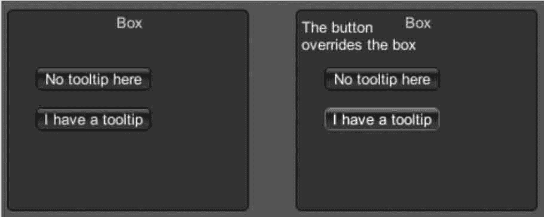

# Unity 3D ToolTip 控件

> 原文：[`c.biancheng.net/view/2702.html`](http://c.biancheng.net/view/2702.html)

Unity 3D ToolTip 控件主要用于显示提示信息，当鼠标移至指定位置时，会显示相应的提示信息，在使用时需要和 GUI.Content 配合，具体使用方法如下：

```

public static var tooltip:string
```

下面是 ToolTip 控件的使用案例。

步骤 1)：创建项目，将其命名为 GUI.Tooltip，保存场景。

步骤 2)：在 Unity 3D 菜单栏中执行 Assets→Create→JavaScript 命令，创建一个新的脚本文件。

步骤 3)：在 Project 视图中双击该脚本文件，打开脚本编辑器，输入下列语句：

```

function OnGUI(){
    GUI.Box(Rect(5, 35, 210, 175), GUIContent("Box", "this box has a tooltip"));
    GUI.Button(Rect(30, 85, 100, 20), "No tooltip here");
    GUI.Button(Rect(30, 120, 100, 20),
    GUIContent("I have a tooltip", "The button overrides the box"));
    GUI.Label(Rect(10, 40, 100, 40), GUI.tooltip);
}
```

步骤 4)：按 Ctrl+S 键保存脚本。

步骤 5)：在 Project 视图中选择脚本，将其连接到 Main Camera 上。

步骤 6)：单击 Play 按钮进行测试，效果如下图所示。

