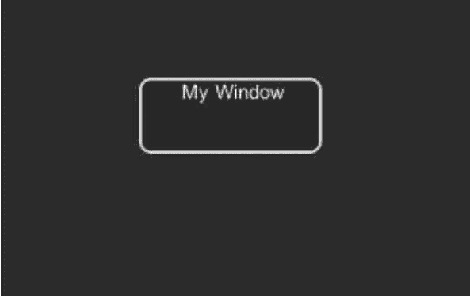

# Unity 3D Drag Window 控件

> 原文：[`c.biancheng.net/view/2703.html`](http://c.biancheng.net/view/2703.html)

Unity 3D Drag Window 控件用于实现屏幕内的可拖曳窗口，具体使用方法如下：

```

public static function DragWindow(position:Rect):void;
```

其中，position 为可拖曳窗口的位置。

Drag Windows 控件的参数如下表所示。

| 参 数 | 功 能 |
| position | 设置可以拖动的窗口的一部分，这部分将被剪切到实际的窗口中 |

下面是 Drag Window 控件的使用案例。

步骤 1)：创建项目，将其命名为 GUI.Dragwindow，保存场景。

步骤 2)：在 Unity 3D 菜单栏中执行 Assets→Create→JavaScript 命令，创建一个新的脚本文件。

步骤 3)：在 Project 视图中双击该脚本文件，打开脚本编辑器，输入下列语句：

```

var windowRect:Rect=Rect(20, 20, 120, 50);
function OnGUI(){
    windowRect=GUI.Window(0, windowRect, DoMyWindow, "My Window");
}
function DoMyWindow(windowID:int){
    GUI.DragWindow(Rect(0, 0, 10000, 20));
}
```

步骤 4)：按 Ctrl+S 键保存脚本。

步骤 5)：在 Project 视图中选择脚本，并将其拖曳到 Hierarchy 视图中的 Main Camera 上，使脚本和摄像机产生关联。

步骤 6)：单击 Play 按钮进行测试，效果如下图所示，当用鼠标拖动窗口时，窗口会随鼠标在屏幕内移动。

