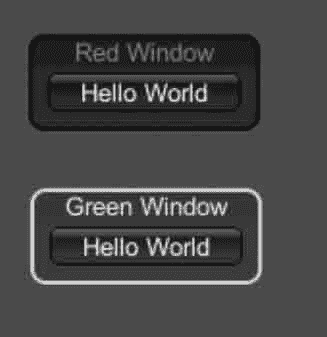

# Unity 3D Window 控件

> 原文：[`c.biancheng.net/view/2706.html`](http://c.biancheng.net/view/2706.html)

通常情况下，一个游戏界面可以由很多窗口组成，在窗口中可以添加任意的功能组件，窗口的使用丰富了游戏界面。

使用 Unity 3D Window 控件可以为当前界面添加窗口，具体方法如下：

```

public static function Window(id:int, clientRect:Rect, func:GUI.WindowFunction,text:string):Rect;
public static function Window(id:int, clientRect:Rect, func:GUI.WindowFunction,image:Texture):Rect;
public static function Window(id:int, clientRect:Rect, func:GUI.WindowFunction,content:GUIContent):Rect;
public static function Window(id:int, clientRect:Rect, func:GUI.WindowFunction,text:string, style:GUIStyle):Rect;
public static function Window(id:int, clientRect:Rect, func:GUI.WindowFunction,image:Texture, style:GUIStyle):Rect;
public static function Window(id:int, clientRect:Rect, func:GUI.WindowFunction,title:GUIContent, style:GUIStyle):Rect;
```

其中，id 为窗口的标号，用以标识窗口，clientRect 为窗口显示区域，func 是回调方法的名称，text 为窗口标题。

Windows 控件的参数如下表所示。

| 参 数 | 功 能 | 参 数 | 功 肯巨 |
| Style | 设置用于窗口的可选样式。如果 遗漏了，则使用当前 GUISkin 的窗 口样式 | id | 设置窗口的 ID 号（可以是任何值， 只要它是唯一的） |
| clientRect | 设置屏幕上的矩形表示的窗口位 置和大小 | func | 设置显示窗口内容的脚本函数 |
| text | 设置文本在窗口内呈现 | image | 设置在窗口中渲染的图像 |
| content | 设置在窗口内渲染的图形 | style | 设置窗口的样式信息 |
| title | 设置文本在窗口标题栏显示 |   |   |

下面是 Window 控件的使用案例。

步骤 1)：创建项目，将其命名为 window，保存场景。

步骤 2)：在 Unity 3D 菜单栏中执行 Assets→Create→JavaScript 命令，创建一个新的脚本文件。

步骤 3)：在 Project 视图中双击该脚本文件，打开脚本编辑器，输入下列语句：

```

var windowRect0:Rect=Rect(20, 20, 120, 50);
var windowRect1:Rect=Rect(20, 100, 120, 50);
function OnGUI(){
    GUI.color=Color.red;
    windowRect0=GUI.Window(0, windowRect0, DoMyWindow, "Red Window");
    GUI.color=Color.green;
    windowRect1=GUI.Window(1, windowRect1, DoMyWindow, "Green Window");
}
function DoMyWindow(windowID:int){
    if(GUI.Button(Rect(10, 20, 100, 20), "Hello World"))
    print("Got a click in window with color"+GUI.color);
    GUI.DragWindow(Rect(0, 0, 10000, 10000));
}
```

步骤 4)：按 Ctrl+S 键保存脚本。

步骤 5)：在 Project 视图中选择脚本，并将其拖曳到 Hierarchy 视图中的 Main Camera 上，使脚本和摄像机产生关联。

步骤 6)：单击 Play 按钮进行测试，效果如下图所示。

