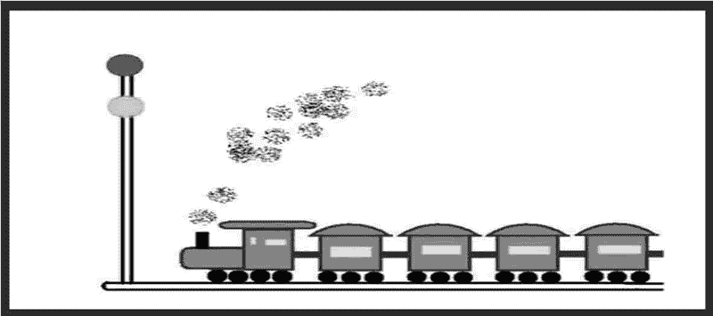

# Unity 3D 贴图

> 原文：[`c.biancheng.net/view/2707.html`](http://c.biancheng.net/view/2707.html)

纯色背景的界面会给人以单调的感觉，Unity 3D 可以使用纹理贴图让游戏界面更加生动。

纹理贴图可以想象成装修时在墙上贴壁纸，通过纹理贴图的方式可以为界面增色添彩，具体使用方法如下：

*   将图片导入 Unity 3D 中，执行 Assets→Import Package→Custom Package 命令找到图片位置，将图片加载进来，图片加载后，可以在 Project 视图中看见刚刚加载的资源文件。
*   选中图片后，将 Texture type 修改成 sprit render 格式，然后将其加载到 Hierarchy 视图中。
*   Unity 3D 会分析图片的宽和高，然后将其加载进来，如果此时发现图片没有全屏显示或者显示的大小不合意，可以在 Inspector 视图中进行图片大小的缩放。贴图效果如下图所示。


除了使用 GUITexture 方法添加贴图外，也可以使用 GUI.DrawTexture 方法绘制贴图，该方法原型如下：

```

function DrawTexture(position:Rect, image:Texture, scaleMode:ScaleMode,alphaBlend:boolean, imageAspect:float)
```

其中，position 为纹理贴图的位置，Image 为所贴纹理图片，scaleMode 为纹理的缩放模式，alphaBlend 为图片的混合模式，imageAspect 为图片缩放的宽高比例。

加载图片资源放置在根目录 Assets 中的 Resource 文件夹下，载入资源时，将整个图片文件夹载入即可。

下面是纹理贴图的使用案例。

步骤 1)：创建项目，将其命名为 texture，保存场景。

步骤 2)：在 Unity 3D 菜单栏中执行 Assets→Create→JavaScript 命令，创建一个新的脚本文件。

步骤 3)：在 Project 视图中双击该脚本文件，打开脚本编辑器，输入下列语句：

```

var aTexture:Texture;
function OnGUI(){
    if(!aTexture){
        Debug.LogError("Assign a Texture in the inspector.");
        return;
    }
    GUI.DrawTexture(Rect(100, 10, 200, 200), aTexture);
}
```

步骤 4)：按 Ctrl+S 键保存脚本。

步骤 5)：在 Project 视图中选择脚本，并将其拖曳到 Hierarchy 视图中的 Main Camera 上，使脚本和摄像机产生关联。

步骤 6)：在 Inspector 视图中添加纹理资源。

步骤 7)：单击 Play 按钮进行测试，效果如下图所示。

