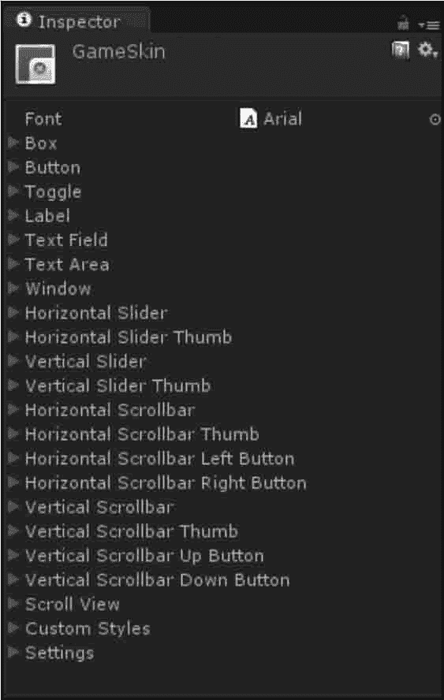
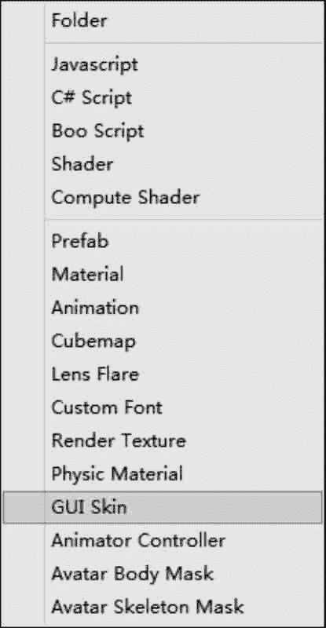
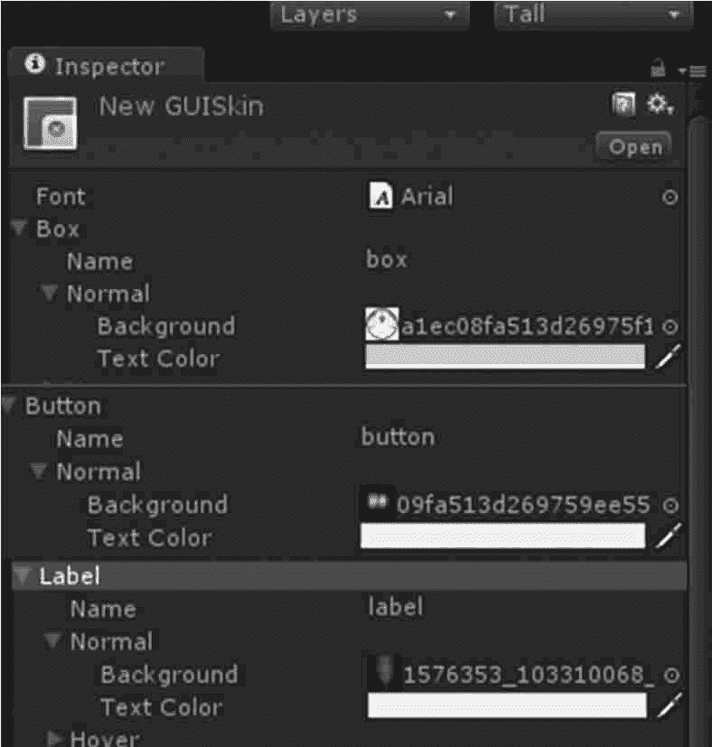
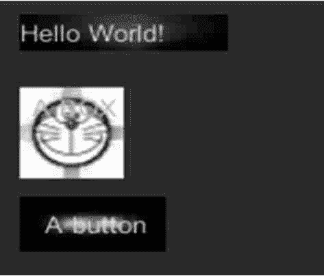

# Unity 3D Skin 控件

> 原文：[`c.biancheng.net/view/2708.html`](http://c.biancheng.net/view/2708.html)

图形用户界面皮肤是图形用户界面样式的集合，集合内有许多控件，每个控件类型拥有很多样式定义。

Skin 文件的 Inspector 面板会显示出可以影响到的所有控件，展开任何一个控件菜单会显示其可以修改的内容，其中包括字体大小、字体类型、背景等。

创建一个图形用户界面皮肤，在菜单栏中执行 Assets→Create→GUI Skin 命令，创建后的 GUI Skin 如下图所示，具体参数如下表所示。



| 参 数 | 含义 | 功 能 |
| Font | 字体 | 用户图形界面中每个控件使用的全局字体 |
| Box | 盒 | 应用于所有盒子控件的样式 |
| Button | 按钮 | 应用于所有按钮控件的样式 |
| Toggle | 切换开关 | 应用于所有切换开关的样式 |
| Label | 标签 | 应用于所有标签控件的样式 |
| Text Field | 文本框 | 应用于所有文本框控件的样式 |
| Text Area | 文本区域 | 应用于所有多行文本域控件的样式 |
| Window | 窗口 | 应用于所有窗口控件的样式 |
| Horizontal Slider | 水平滑动条 | 应用于所有水平滑动条控件的样式 |
| Horizontal Slider Thumb | 水平滑块 | 应用于所有水平滑块控件的样式 |
| Vertical Slider | 垂直滑动条 | 应用于所有垂直滑动条控件的样式 |
| Vertical Slider Thumb | 垂直滑块 | 应用于所有垂直滑块控件的样式 |
| Horizontal Scrollbar | 水平滚动条 | 应用于所有水平滚动条控件的样式 |
| Horizontal Scrollbar Thumb | 水平滚动条滑块 | 应用于所有水平滚动条滑块控件的样式 |
| Horizontal Scrollbar Left Button | 水平滚动条左侧按钮 | 应用于所有水平滚动条左侧按钮控件的样式 |
| Horizontal Scrollbar Right Button | 水平滚动条右侧按钮 | 应用于所有水平滚动条右侧按钮控件的样式 |
| Vertical Scrollbar | 垂直滚动条 | 应用于所有垂直滚动条控件的样式 |
| Vertical Scrollbar Thumb | 垂直滚动条滑块 | 应用于所有垂直滚动条滑块控件的样式 |
| Vertical Scrollbar Up Button | 垂直滚动条顶部按钮 | 应用于所有垂直滚动条顶部按钮控件的样式 |
| Vertical Scrollbar Down Button | 垂直滚动条底部按钮 | 应用于所有垂直滚动条底部按钮控件的样式 |
| Custom 1-20 | 自定义 | 附加的自定义样式可以应用于任何控件 |
| Custom Styles | 自定义样式 | 一个带有可以应用于任何控件的自定义样式 的集合 |
| Settings | 设定 | 所有图形用户界面的附加设定 |

下面是 Skin 控件的使用案例。

步骤 1)：创建项目，将其命名为 GUISkin，保存场景。

步骤 2)：加载图片资源，将图片资源放置在根目录 Assets 中的 Resource 文件夹下。

步骤 3)：单击 Project 视图下拉三角，创建 GUI Skin，如图下图所示。


步骤 4)：在 Inspector 面板中修改 GUI Skin 参数，分别设置 Box、Button、Label 样式，如下图所示。


步骤 5)：在 Unity 3D 菜单栏中执行 Assets→Create→JavaScript 命令，创建一个新的脚本文件。

步骤 6)：在 Project 视图中双击该脚本文件，打开脚本编辑器，输入下列语句：

```

var s1:GUISkin[];
private var cont:int=0;
function OnGUI(){
    GUI.skin=s1[cont%s1.Length];
    if(s1.Length==0){
        Debug.LogError("Assign at least 1 skin on the array");
        return;
    }
    GUI.Label(Rect(10, 10, 100, 20), "Hello World!");
    GUI.Box(Rect(10, 50, 50, 50), "A BOX");
    GUI.Button(Rect(10, 110, 70, 30), "A button");
}
```

步骤 7)：按 Ctrl+S 键保存脚本。

步骤 8)：在 Project 视图中选择脚本，将其连接到 Main Camera 上。

步骤 9)：在 Inspector 视图中添加纹理资源，并将 GUI Skin 拖动到 Main Camera 的 Inspector 视图下。

步骤 10)：单击 Play 按钮进行测试，效果如下图所示。

