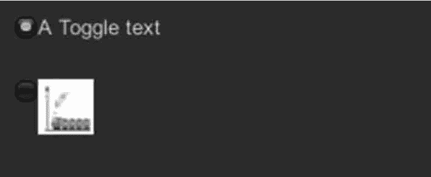

# Unity 3D Toggle 控件

> 原文：[`c.biancheng.net/view/2710.html`](http://c.biancheng.net/view/2710.html)

Unity 3D Toggle 控件用于在屏幕上绘制一个开关，通过控制开关的开启与闭合来执行一些具体的操作。

当用户切换开关状态时，Toggle 控件的绘制函数就会根据不同的切换动作来返回相应的布尔值。

选中 Toggle 控件会返回布尔值 true，取消选中就会返回布尔值 false。具体使用方法如下，

```

public static function Toggle(position:Rect, value:bool, text:string):bool;
public static function Toggle(position:Rect, value:bool, image:Texture):bool;
public static function Toggle(position:Rect, value:bool, content:GUIContent):bool;
public static function Toggle(position:Rect, value:bool, text:string, style:GUIStyle):bool;
public static function Toggle(position:Rect, value:bool, image:Texture, style:GUIStyle):bool;
public static function Toggle(position:Rect, value:bool, content:GUIContent,style:GUIStyle):bool;
```

其中，position 为控件显示位置，value 为默认控件是开还是关，text 为控件显示的字符内容。

Toggle 控件的参数如下表所示。

| 参 数 | 功 能 | 参 数 | 功 能 |
| position | 设置控件在屏幕上的位置及大小 | text | 设置控件上显示的文本 |
| image | 设置控件上显示的纹理图片 | content | 设置控件的文本、图片和提示 |
| style | 设置控件使用的样式 | value | 设置开关是开启还是关闭 |

下面是 GUI.Toggle 控件的使用案例。

步骤 1)：创建项目，将其命名为 GUI.Toggle，保存场景。

步骤 2)：在 Unity 3D 菜单栏中执行 Assets→Create→JavaScript 命令，创建一个新的脚本文件。

步骤 3)：在 Project 视图中双击该脚本文件，打开脚本编辑器，输入下列语句：

```

var aTexture:Texture;
private var toggleTxt:boolean=false;
private var toggleImg:boolean=false;
function OnGUI(){
    if(!aTexture){
        Debug.LogError("Please assign a texture in the inspector.");
        return;
    }
    toggleTxt=GUI.Toggle(Rect(10, 10, 100, 30), toggleTxt, "A Toggle text");
    toggleImg=GUI.Toggle(Rect(10, 50, 50, 50), toggleImg, aTexture);
}
```

步骤 4)：按 Ctrl+S 键保存脚本。

步骤 5)：在 Project 视图中选择脚本，将其连接到 Main Camera 上。

步骤 6)：在 Inspector 视图中添加纹理资源。

步骤 7)：单击 Play 按钮进行测试，效果如下图所示。

