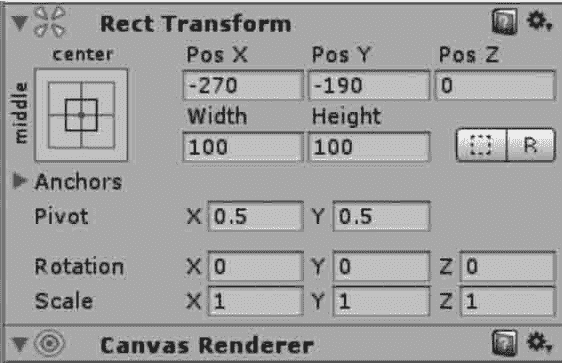

# Unity 3D UGUI 系统及常用控件

> 原文：[`c.biancheng.net/view/2712.html`](http://c.biancheng.net/view/2712.html)

UGUI 是 Unity 官方的 UI 实现方式，自从 Unity 4.6 起，Unity 官方推出了新版 UGUI 系统。

新版 UGUI 系统相比于 OnGUI 系统更加人性化，而且是一个开源系统，利用游戏开发人员进行游戏界面开发。

UGUI 系统有 3 个特点：灵活、快速、可视化。

对于游戏开发者来说，UGUI 运行效率高，执行效果好，易于使用，方便扩展，与 Unity 3D 兼容性高。

在 UGUI 中创建的所有 UI 控件都有一个 UI 控件特有的 Rect Transform 组件。

在 Unity 3D 中创建的三维物体是 Transform，而 UI 控件的 Rect Transform 组件是 UI 控件的矩形方位，其中的 PosX、PosY、PosZ 指的是 UI 控件在相应轴上的偏移量。

UI 控件除了 Rect Transform 组件外，还有一个 Canvas Renderer（画布渲染）组件，如上图所示。一般不用理会它，因为它不能被点开。

下面介绍一些 UGUI 中常用的控件：

*   Unity 3D Canvas 画布
*   Unity 3D Event System 事件系统
*   Unity 3D Panel 控件
*   Unity 3D Text 控件
*   Unity 3D Image 控件
*   Unity 3D Raw Image 控件
*   Unity 3D UGUI Button 控件
*   Unity 3D UGUI Toggle 控件
*   Unity 3D UGUI Slider 控件
*   Unity 3D Scrollbar 控件
*   Unity 3D Input Field 控件