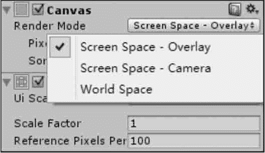

# Unity 3D Canvas 画布

> 原文：[`c.biancheng.net/view/2714.html`](http://c.biancheng.net/view/2714.html)

Canvas 是画布，是摆放所有 UI 元素的区域，在场景中创建的所有控件都会自动变为 Canvas 游戏对象的子对象，若场景中没有画布，在创建控件时会自动创建画布。

创建画布有两种方式：

*   一是通过菜单直接创建；
*   二是直接创建一个 UI 组件时自动创建一个容纳该组件的画布。

不管用哪种方式创建画布，系统都会自动创建一个名为 EventSystem 的游戏对象，上面挂载了若干与事件监听相关的组件可供设置。

在画布上有一个 Render Mode 属性，它有 3 个选项，如下图所示。

它们分别对应画布的 3 种渲染模式：Screen Space-Overlay、Screen Space-Camera 和 World Space。

#### 1) Screen Space-Overlay 渲染模式

在 Screen Space-Overlay 渲染模式下，场景中的 UI 被渲染到屏幕上，如果屏幕大小改变了或更改了分辨率，画布将自动更改大小以适配屏幕。

此种模式不需要 UI 摄像机，UI 将永远出现在所有摄像机的最前面。

Screen Space-Overlay 渲染模式的参数如下表所示。

| 参 数 | 功 能 |
| Pixel Perfect | 重置元素大小和坐标，使贴图的像素完美对应到屏幕像素上 |
| Sort Order | 排列顺序 |

#### 2) Screen Space-Camera 渲染模式

Screen Space-Camera 渲染模式类似于 Screen Space-Overlay 渲染模式。

这种渲染模式下，画布被放置在指定摄像机前的一个给定距离上，它支持在 UI 前方显示 3D 模型与粒子系统等内容，通过指定的摄像机 UI 被呈现出来，如果屏幕大小改变或更改了分辨率，画布将自动更改大小以适配屏幕。

Screen Space-Camera 渲染模式的参数如下表所示。

| 参 数 | 功 能 |
| Pixel Perfect | 重置元素大小和坐标，使贴图的像素完美对应到屏幕像素上 |
| Render Camera | UI 绘制所对应的摄像机 |
| Plane Distance | UI 距离摄像机镜头的距离 |
| Sorting Layer | 界面分层，执行 Edit→Project Setting→Tags and Layers→Sorting Layers 命令进 行界面分层，越下方的层在界面显示时越在前面 |
| Order Layer | 界面顺序，该值越高，在界面显示时越在前面 |

#### 3) World Space 渲染模式

在 World Space 渲染模式下呈现的 UI 好像是 3D 场景中的一个 Plane 对象。与前两种渲染模式不同，其屏幕的大小将取决于拍摄的角度和相机的距离。

它是一个完全三维的 UI，也就是把 UI 也当成三维对象，例如摄像机离 UI 远了，其显示就会变小，近了就会变大。

World Space 渲染模式的参数如下表所示。

| 参 数 | 功 能 |
| Event Camera | 设置用来处理用户界面事件的摄像机 |
| Sorting Layer | 界面分层，执行 Edit→Project Setting→Tags and Layers→Sorting Layers 命令进 行界面分层，越下方的层在界面显示时越在前面 |
| Order Layer | 界面顺序，该值越高，在界面显示时越在前面 |