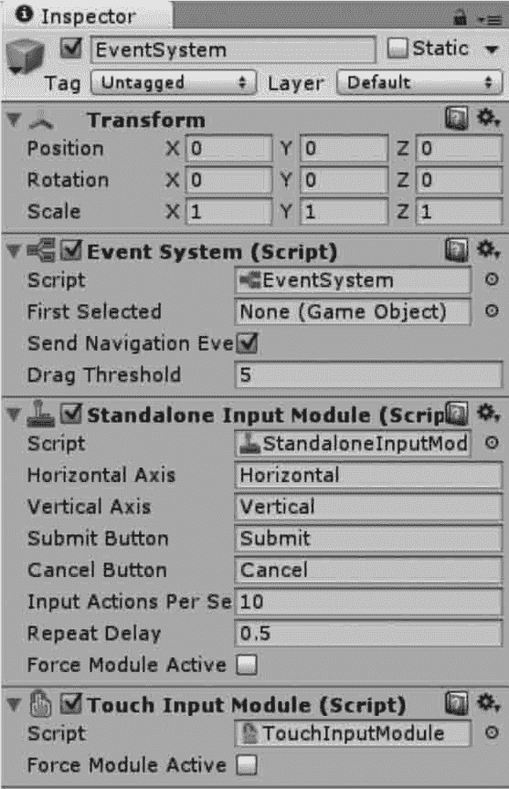

# Unity 3D Event System 事件系统

> 原文：[`c.biancheng.net/view/2717.html`](http://c.biancheng.net/view/2717.html)

创建 UGUI 控件后，Unity 3D 会同时创建一个叫 Event System（事件系统）的 GameObject，用于控制各类事件。

如下图所示。可以看到 Unity 3D 自带了两个 Input Module，一个用于响应标准输入，另一个用于响应触摸操作。

Input Module 封装了 Input 模块的调用，根据用户操作触发各 Event Trigger。

Event System 事件处理器中有 3 个组件：

#### 1) Event System 事件处理组件

是一种将基于输入的事件发送到应用程序中的对象，使用键盘、鼠标、触摸或自定义输入均可。

#### 2) Standalone Input Module（独立输入模块）

用于鼠标、键盘和控制器。该模块被配置为查看 InputManager，基于输入 InputManager 管理器的状态发送事件。

#### 3) Touch Input Module（触控输入模块）

被设计为使用在可触摸的基础设备上。