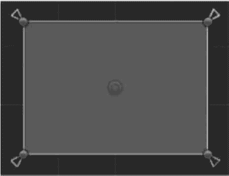
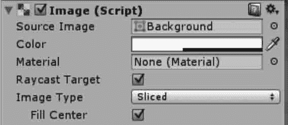

# Unity 3D Panel 控件

> 原文：[`c.biancheng.net/view/2722.html`](http://c.biancheng.net/view/2722.html)

Unity 3D panel 控件又叫面板，面板实际上就是一个容器，在其上可放置其他 UI 控件。

当移动面板时，放在其中的 UI 控件就会跟随移动，这样可以更加合理与方便地移动与处理一组控件。

拖动面板控件的 4 个角或 4 条边可以调节面板的大小。

一个功能完备的 UI 界面往往会使用多个 Panel 容器控件，而且一个面板里还可套用其他面板，如下图所示。

当创建一个面板时，此面板会默认包含一个 Image（Script）组件，如下图所示。

其中，Source Image 用来设置面板的图像，Color 用来改变面板的颜色。

