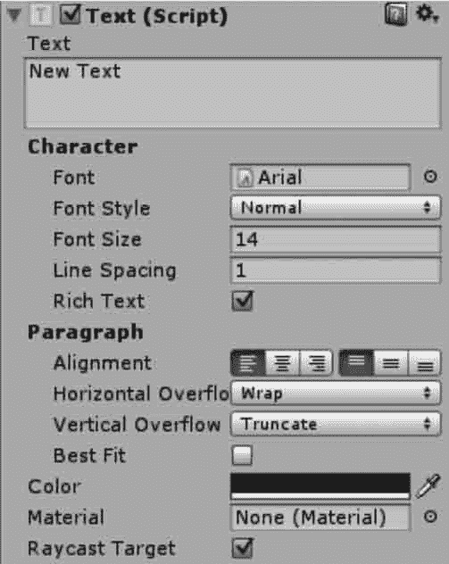

# Unity 3D Text 控件

> 原文：[`c.biancheng.net/view/2723.html`](http://c.biancheng.net/view/2723.html)

在 Unity 3D UGUI 中创建的很多 UI 控件都有一个支持文本编辑的 Text 控件。

Text 控件也称为标签，Text 区域用于输入将显示的文本。它可以设置字体、样式、字号等内容，如下图所示，具体参数如下表所示。

| 参 数 | 功 能 |
| Font | 设置字体 |
| Font Style | 设置字体样式 |
| Font Size | 设置字体大小 |
| Line Spacing | 设置行间距（多行） |
| Rich Text | 设置富文本 |
| Alignment | 设置文本在 Text 框中的水平以及垂直方向上的对齐方式 |
| Horizontal Overflow | 设置水平方向上溢出时的处理方式。分两种：Wrap(隐藏）；C)verflow(溢出） |
| Vertical Overflow | 设置垂直方向上溢出时的处理方式。分两种：Truncate(截断）；Overflow(溢出） |
| Best Fit | 设置当文字多时自动缩小以适应文本框的大小 |
| Color | 设置字体颜色 |