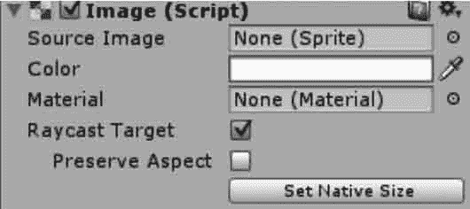

# Unity 3D Image 控件

> 原文：[`c.biancheng.net/view/2724.html`](http://c.biancheng.net/view/2724.html)

Unity 3D Image 控件除了两个公共的组件 Rect Transform 与 Canvas Renderer 外，默认的情况下就只有一个 Image 组件，如下图所示。

其中，Source Image 是要显示的源图像，要想把一个图片赋给 Image，需要把图片转换成精灵格式，转化后的精灵图片就可拖放到 Image 的 Source Image 中了。

转换方法为：在 Project 视图中选中要转换的图片，然后在 Inspector 属性面板中，单击 Texture Type（纹理类型）右边的下拉列表，选中 Sprite（2D and UI）并单击下方的 Apply 按钮，就可以把图片转换成精灵格式，然后就可以拖放到 Image 的 Source Image 中了。

Image 控件的参数如下表所示。

| 参 数 | 功 能 | 参 数 | 功 能 |
| Color | 设置应用在图片上的颜色 | Image Type | 设置贴图类型 |
| Material | 设置应用在图片上的材质 |   |   |