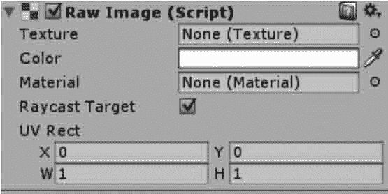

# Unity 3D Raw Image 控件

> 原文：[`c.biancheng.net/view/2726.html`](http://c.biancheng.net/view/2726.html)

Unity 3D Raw Image 控件向用户显示了一个非交互式的图像，如下图所示。它可以用于装饰、图标等。

Raw Image 控件类似于 Image 控件，但是，Raw Image 控件可以显示任何纹理，而 Image 只能显示一个精灵。

Raw Image 控件的参数如下表所示。

| 参 数 | 功 能 |
| Texture | 设置要显示的图像纹理 |
| Color | 设置应用在图片上的颜色 |
| Material | 设置应用在图片上的材质 |
| UV Rect | 设置图像在控件矩形中的偏移和大小，范围为 0〜1 |