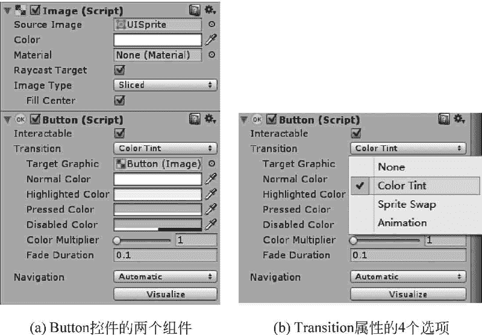

# Unity 3D UGUI Button 控件

> 原文：[`c.biancheng.net/view/2727.html`](http://c.biancheng.net/view/2727.html)

除了公共的 Rect Transform 与 Canvas Renderer 两个 UI 组件外，Unity 3D Button 控件还默认拥有 Image 与 Button 两个组件，如下图（a）所示。

Image 组件里的属性与前面介绍的是一样的。Button 是一个复合控件，其中还包含一个 Text 子控件，通过此子控件可设置 Button 上显示的文字的内容、字体、文字样式、文字大小、颜色等，与前面所讲的 Text 控件是一样的。

Button 控件属性如下：

#### 1) Interactable（是否启用交互）

如果把其后的对钩去掉，此 Button 在运行时将不可单击，即失去了交互性。

#### 2) Transition（过渡方式）

共有 4 个选项，如下图（b）所示。默认为 Color Tint（颜色色彩）。

*   None：没有过渡方式。
*   Color Tint：颜色过渡，相关属性如下表所示。
*   Sprite Swap：精灵交换，需要使用相同功能、不同状态的贴图，相关属性如下表所示。
*   Animation：动画过渡。

Color Tint 的属性如下：

| 属 性 | 功 能 | 属 性 | 功 肯巨 |
| Target Graphic | 设置目标图像 | Disabled Color | 设置禁用色 |
| Normal Color | 设置正常颜色 | Color Multiplier | 设置颜色倍数 |
| Highlighted Color | 设置高亮色 | Fade Duration | 设置变化持续的时间 |
| Pressed Color | 设置单击色 |   |   |

Sprite Swap 的属性如下：

| 属 性 | 功 肯运 | 属 性 | 功 能 |
| Target Graphic | 设置目标图像 | Pressed Sprite | 设置单击时的贴图 |
| Highlighted Sprite | 设置鼠标经过时的贴图 | Disabled Sprite | 设置禁用时的贴图 |