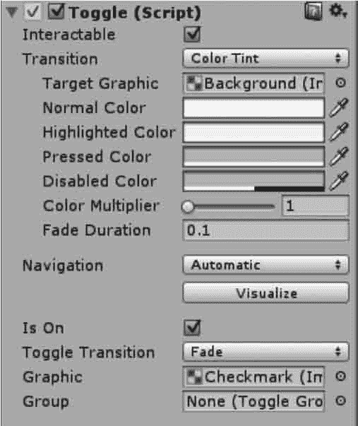

# Unity 3D UGUI Toggle 控件

> 原文：[`c.biancheng.net/view/2728.html`](http://c.biancheng.net/view/2728.html)

Unity 3D Toggle 控件也是一个复合型控件，如下图所示。它有 Background 与 Label 两个子控件，而 Background 控件中还有一个 Checkmark 子控件。

Background 是一个图像控件，而其子控件 Checkmark 也是一个图像控件，其 Label 控件是一个文本框，通过改变它们所拥有的属性值，即可改变 Toggle 的外观，如颜色、字体等。

Toggle 控件的参数如下表所示。

| 属 性 | 功 能 |
| Is On | 设置复选框默认是开还是关 |
| Toggle Transition | 设置渐变效果 |
| Graphic | 用于切换背景，更改为一个更合适的图像 |
| Group | 设置多选组 |