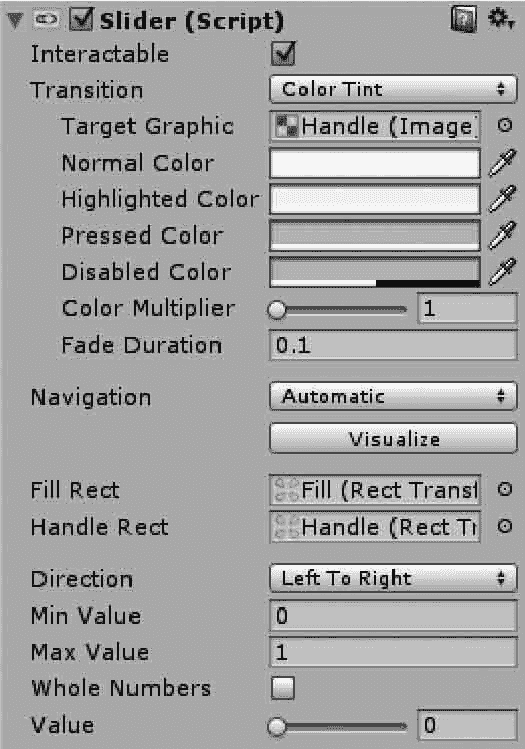

# Unity 3D UGUI Slider 控件

> 原文：[`c.biancheng.net/view/2729.html`](http://c.biancheng.net/view/2729.html)

在游戏的 UI 界面中会见到各种滑块，用来控制音量或者是摇杆的灵敏度。

Unity 3D Slider 控件也是一个复合控件，Background 是背景，默认颜色是白色，Fill Area 是填充区域，如下图所示。

Slider 控件的一个需要注意的参数是 Whole Number，该参数表示滑块的值是否只可为整数，开发人员可根据需要进行设置。

除此以外，Slider 控件也可以挂载脚本，用来响应事件监听。

Slider 控件的参数如下表所示。

| 属 性 | 功 能 | 属 性 | 功 能 |
| Fill Rect | 设置填充矩形区域 | Max Value | 设置最大数值 |
| Handle Rect | 设置手柄矩形区域 | Whole Numbers | 设置整数数值 |
| Direction | 设置 Slider 的摆放方向 | Value | 设置滑块当前的数值 |
| Min Value | 设置最小数值 |   |   |