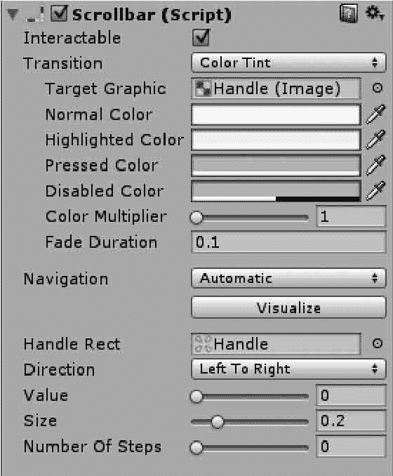

# Unity 3D Scrollbar 控件

> 原文：[`c.biancheng.net/view/2730.html`](http://c.biancheng.net/view/2730.html)

Unity 3D Scrollbar（滚动条）控件可以垂直或水平放置，主要用于通过拖动滑块以改变目标的比例，如下图所示。

它最恰当的应用是用来将一个值变为指定百分比，最大值为 1（100%），最小值为 0（0%），拖动滑块可在 0 和 1 之间改变，例如改变滚动视野的显示区域。

Scrollbar 控件的参数如下表所示。

| 参 数 | 功 能 |
| Handle Rect | 设置最小值与最大值之间的范围，也就是整个滑条的最大可控制范围。 |
| Direction | 设置滚动条的方向为从左至右、从上至下或其他的方向 |
| Value | 设置当前滚动条对应的值 |
| Size | 设置操作条矩形对应的缩放长度，即 handle 部分的大小，取值为 0〜1 |
| Numbers Of Steps | 设置滚动条可滚动的位置数目 |
| On Value Changed | 设置值改变时触发消息 |