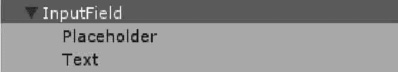
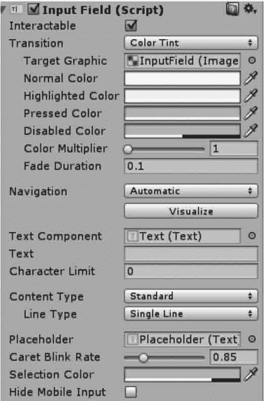
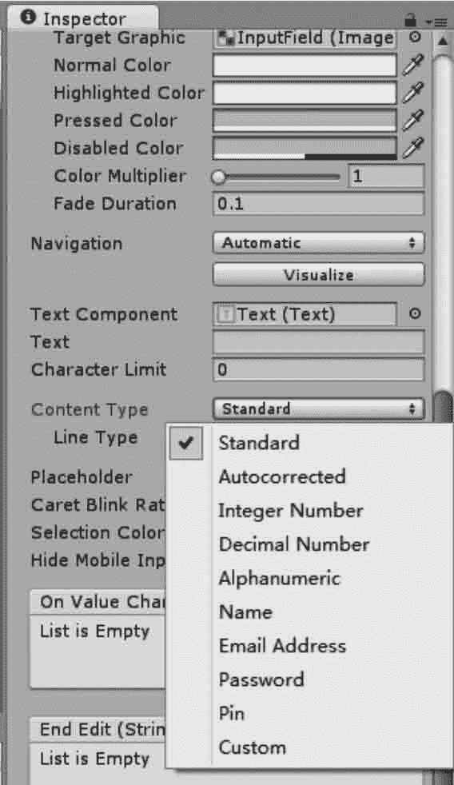

# Unity 3D Input Field 控件

> 原文：[`c.biancheng.net/view/2732.html`](http://c.biancheng.net/view/2732.html)

Unity 3D Input Field 控件也是一个复合控件，包含 Placeholder 与 Text 两个子控件，如下图所示。

其中，Text 是文本控件，程序运行时用户所输入的内容就保存在 Text 控件中，Placeholder 是占位符，表示程序运行时在用户还没有输入内容时显示给用户的提示信息。

Input Field 输入字段组件与其他控件一样，也有 Image（Script）组件，另外也包括 Transition 属性，其默认是 Color Tint，如下图所示，具体属性如下表所示。

| 参 数 | 功 能 |
| Interactable | 设置是否启用 Input Field 组件。勾选表示输入字段可以交互，否则表示不可以 交互 |
| Transition | 设置当正常显示、突出显示、按下或禁用时输入字段的转换效果 |
| Navigation | 设置导航功能 |
| Text Component | 设置此输人域的文本显示组件，用于显示用户输人的文本框 |
| Text | 设置此输入域的初始值 |
| Character Limit | 设置此输人域最大的输入字符数，0 为不限制输入字符数 |
| Content Type | 输人此输人域的内容类型，包括数字、密码等，常用的类型如下： 
*   Standard：允许输人任何字符，只要是当前字体支持的即可。
*   Autocorrected:自动校正输入的未知单词，并建议更合适的替换候选对象，除非 用户明确地覆盖该操作，否则将自动替换输入的文本。
*   Integer Number：只允许输入整数。
*   Decimal Number：允许输入整数或小数。
*   Alpha numeric：允许输人数字和字母。
*   Name：允许输入英文及其他文字，当输人英文时能自动提示姓名拼写。
*   Email Address：允许输人一个由最多一个 @ 符号组成的字母数字字符串。
*   Password：输入的字符被隐藏，只显 7K 星号。
*   Pin：只允许输人整数。输入的字符被隐藏，只显示星号。
*   Custom：允许用户自定义行类型、输入类型、键盘类型和字符验证

 |
| Line Type | 设置当输人的内容超过输入域边界时的换行方式： 
*   Single Line：超过边界也不换行，继续向右延伸此行，即输入域中的内容只有一行
*   Muhi Line Submit:允许文本换行。只在需要时才换行。
*   Multi Line Newline：允许文本换行。用户可以按回车键来换行

 |
| Placeholder | 设置此输入域的输人位控制符，对于任何带有 Text 组件的物体均可设置此项 |

除此以外，它还有一个重要的 Content Type（内容类型）属性，如下图所示，其参数如下表所示。

| 参 数 | 功 能 | 参 数 | 功 能 |
| Standard | 标准的 | Name | 人名 |
| Autocorrected | 自动修正 | Email Address | 邮箱 |
| Integer Number | 整数 | Password | 密码 |
| Decimal Number | 十进制小数 | Pin | 固定 |
| Alphanumeric | 字母数字 | Custom | 定制的 |