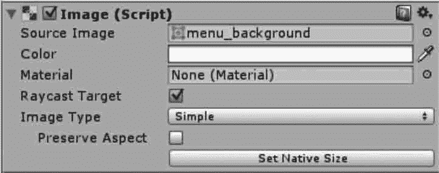
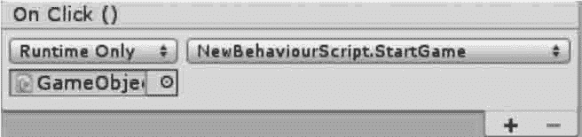

# Unity 3D UGUI 实例演示

> 原文：[`c.biancheng.net/view/2733.html`](http://c.biancheng.net/view/2733.html)

在前面的几节我们从整体上对图形用户界面下的各个控件进行详细讲解，使我们对新版的图形用户界面 UGUI 有了更深的了解，新版的 UGUI 系统比 OnGUI 系统相比有了很大提升，使用起来方便，控件更加美观，接下来我们使用 UGUI 控件开发一个完整的游戏界面。

## 实践案例：游戏界面开发

#### 案例构思

Unity 3D 新增的图形用户界面系统 UGUI 与旧版的 GUI 系统相比更加人性化，而且是一个开源的系统。本案例旨在利用 UGUI 控件开发完整的游戏界面。

#### 案例设计

本案例基于 UGUI 技术实现一套完整的游戏界面，其中包括界面背景、文字标题、进入按钮、设置页面等内容，效果如下图所示。


#### 案例实施

步骤 1)：导入 Menu and Fonts 资源包，这个包包含背景图片、按钮、图标或者其他的游戏元素，如下图所示。


步骤 2)：在菜单中执行 GameObject→UI→Image 命令，在场景中添加一个 Image，用来显示 Sprite texture，它继承 Canvas。同时加载 EventSystem 负责处理场景中的输入、映射和事件。

步骤 3)：在项目浏览器中打开 Menu 文件，找到 menu_background 图片，把它拖到 Source Image 区域中，并调整合适大小，属性面板和添加效果如下图所示



步骤 4)：按照同样的方法在 Menu 文件中搜索 header_label 图片，然后在菜单中执行 GameObject→UI→Image 命令，将 header_label 拖到 Source Image 区域中，并调整合适大小，如下图所示。


步骤 5)：在菜单中执行 GameObject→UI→Button 命令，在场景中加入一个按钮，然后选中嵌入的 Text 元素，设置文本为 Start Game，并设定字体样式以及字体大小，如下图所示。


步骤 6)：选中 Button，在 Inspector 面板中找到 Source Image，并赋予图片，效果如下图所示。


步骤 7)：创建脚本 NewBehaviourScript，编写代码如下：

```

using UnityEngine;
using System.Collections;
public class NewBehaviourScript:MonoBehaviour{
    public void StartGame(){
        Application.LoadLevel("RocketMouse");
    }
}
```

步骤 8)：脚本链接。创建空物体，将脚本链接到空物体上，然后在 Hierarchy 视图中选择创建好的按钮，向下滑到 On Click 列表中，单击加号，接下来拖动 Hierarchy 视图中的空物体，把它添加到 Inspector 列表中，在下拉框中把它的功能设置为 No Function，最后在打开的菜单中选择 UIManagerScript\StartGame()，如下图所示。


步骤 9)：创建一个新的 Button 控件，并将齿轮图片赋予它，如下图所示。


步骤 10)：新建 C# 脚本，将其命名为 setting，编写代码，并链接到空物体上，代码如下：

```

using UnityEngine;
using System.Collections;
public class setting:MonoBehaviour{
    public GameObject panel;
    private bool isclick=false;
    void playRenwu(bool isnotclick){
        panel.gameObject.SetActive(isnotclick);
    }
    public void Onclickbutton(){
        if(isclick==false){
            isclick=true;
            playRenwu(true);
        }else{
            isclick=false;
            playRenwu(false);
        }
    }
}
```

步骤 11)：在菜单中执行 GameObject→UI→Panel 命令，赋予背景图片，并在其上添加 Button 控件，效果如下图所示。


步骤 12)：将创建好的 panel 赋予 setting 脚本，如下图所示。


步骤 13)：修改 NewBehaviourScript 脚本。

```

using UnityEngine;
using System.Collections;
public class NewBehaviourScript:MonoBehaviour{
    public void StartGame(){
        Application.LoadLevel("RocketMouse");
    }
    public void Back(){
        Application.LoadLevel("menu");
    }
}
```

步骤 14)：隐藏 panel，然后设置 panel 下的 button 脚本链接，将 Back 界面跳转函数赋予 Button，实现界面跳转功能。

步骤 15)：保存场景，并执行 build 命令发布，最终测试效果如下图所示。


 