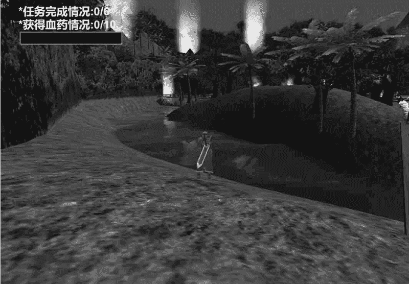

# Unity 3D 地形系统概述

> 原文：[`c.biancheng.net/view/2736.html`](http://c.biancheng.net/view/2736.html)

三维游戏世界大多能给人以沉浸感，在三维游戏世界中，通常会将很多丰富多彩的游戏元素融合在一起，比如游戏中起伏的地形、郁郁葱葱的树木、蔚蓝的天空、漂浮在天空中的朵朵祥云、凶恶的猛兽等，让玩家置身游戏世界，忘记现实。

地形作为游戏场景中必不可少的元素，作用非常重要。Unity 3D 有一套功能强大的地形编辑器，支持以笔刷方式精细地雕刻出山脉、峡谷、平原、盆地等地形，同时还包含了材质纹理、动植物等功能。

可以让开发者实现游戏中任何复杂的游戏地形。

不可否认，可玩性是衡量一款游戏成功与否最主要的标准，这一点从《魔兽世界》的成功就可以看出。

玩家在玩一款游戏过程中第一印象是非常重要的，第一印象决定了玩家是否想继续玩下去，在玩家玩下去的同时才能展现出游戏的可玩性，所以游戏的场景设计也是评价一款游戏的标准。

场景涉及人物、地形以及各类型的建筑模型。大多数人物模型和建筑模型都是在 3ds Max、Maya 等专业的三维模型制作软件中做出来的。

虽然 Unity 3D 也提供了三维建模，但还是相当简单。不过在地形方面 Unity 3D 已经相当强大，下图就是基于 Unity 3D 开发的游戏场景。

