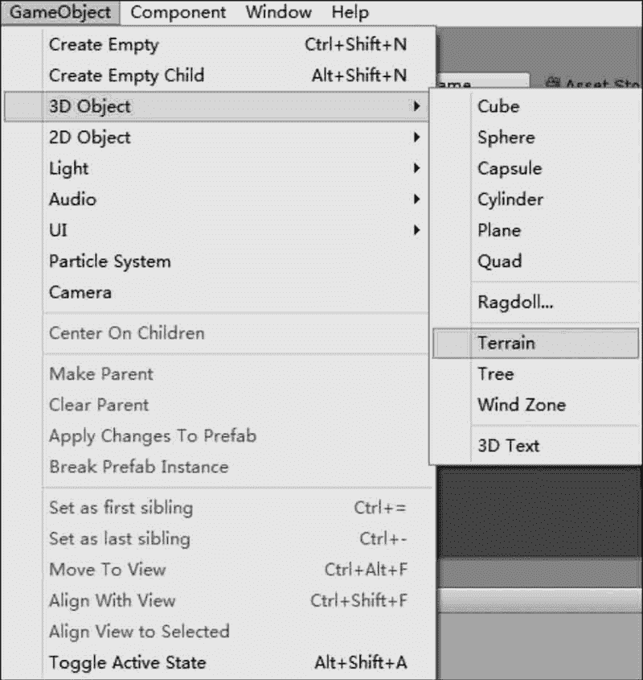
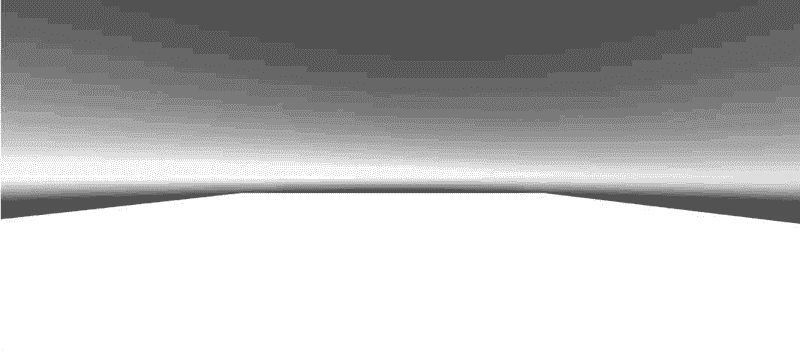
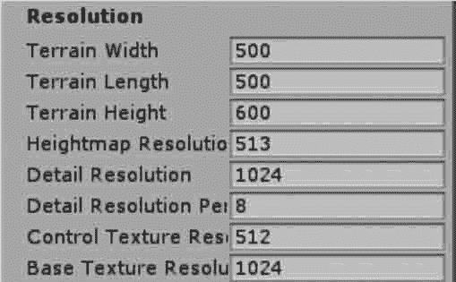

# Unity 3D 如何创建地形？

> 原文：[`c.biancheng.net/view/2738.html`](http://c.biancheng.net/view/2738.html)

Unity 3D 有一套功能强大的地形编辑器，支持以笔刷方式精细地雕刻出山脉、峡谷、平原、盆地等地形，同时还包含了材质纹理、动植物等功能，可以让开发者实现游戏中任何复杂的游戏地形。

## 创建地形

执行菜单 GameObject→3D Object→Terrain 命令，如下图所示，窗口内会自动产生一个平面，这个平面是地形系统默认使用的基本原型。

在 Hierarchy 视图中选择主摄像机，可以在 Scene 视图中观察到游戏地形。如果想调节地形的显示区域，可以调整摄像机或地形的位置与角度，让地形正对着我们，如下图所示。

## 地形参数

Unity 3D 创建地形时采用了默认的地形大小、宽度、厚度、图像分辨率、纹理分辨率等，这些数值是可以任意修改的。

选择创建的地形，在 Inspector 视图中找到 Resolution 属性面板，如下图所示。Resolution 属性面板的参数如下表所示。

| 参 数 | 含 义 | 功 能 |
| Terrain Width | 地形宽度 | 全局地形总宽度 |
| Terrain Length | 地形长度 | 全局地形总长度 |
| Terrain Height | 地形高度 | 全局地形允许的最大高度 |
| Heightmap Resolution | 高度图分辨率 | 全局地形生成的高度图的分辨率 |
| Detail Resolution | 细节分辨率 | 全局地形所生成的细节贴图的分辨率 |
| Detail Resolution Per Patch | 每个子地形块的网格分辨率 | 全局地形中每个子地形块的网格分辨率 |
| Control Texture Resolution | 控制纹理的分辨率 | 把地形贴图绘制到地形上时所使用的贴图分辨率 |
| Base Texture Resolution | 基础纹理的分辨率 | 远处地形贴图的分辨率 |