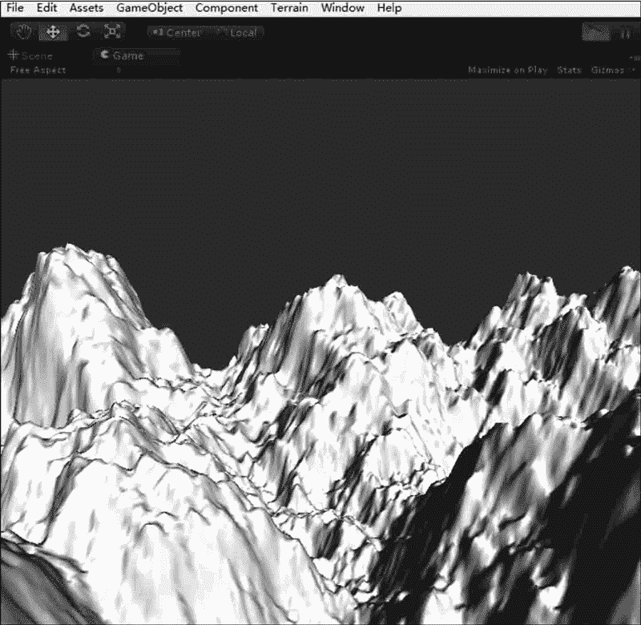
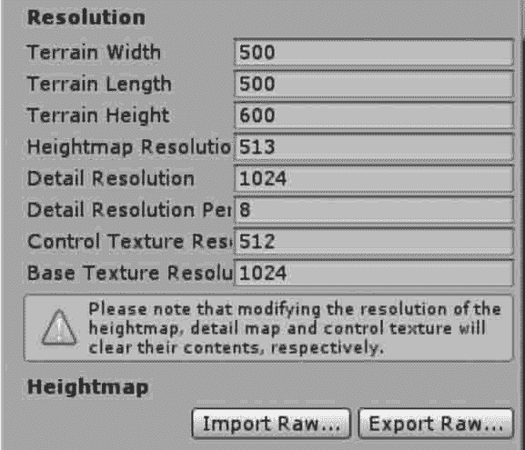
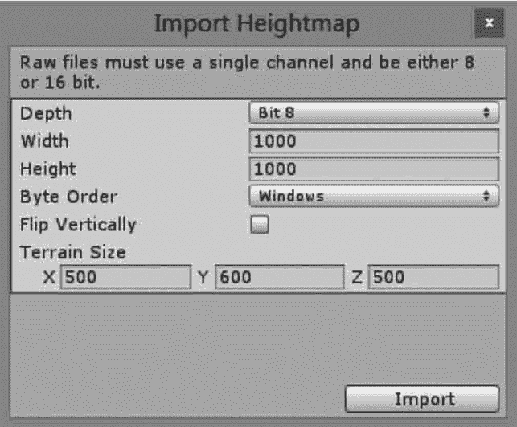

# Unity 3D 使用高度图创建地形

> 原文：[`c.biancheng.net/view/2739.html`](http://c.biancheng.net/view/2739.html)

在 Unity 3D 中编辑地形有两种方法：一种是通过地形编辑器编辑地形，另一种是通过导入一幅预先渲染好的灰度图来快速地为地形建模。

地形上每个点的高度被表示为一个矩阵中的一列值。这个矩阵可以用一个被称为高度图（heightmap）的灰度图来表示。

灰度图是一种使用二维图形来表示三维的高度变化的图片。近黑色的、较暗的颜色表示较低的点，接近白色的、较亮的颜色表示较高的点。

通常可以用 Photoshop 或其他三维软件导出灰度图，灰度图的格式为 RAW 格式，Unity 3D 可以支持 16 位的灰度图。

Unity 提供了为地形导入、导出高度图的选项。单击 Settings tool 按钮，找到标记为 Import RAW 和 Export RAW 的按钮。这两个按钮允许从标准 RAW 格式中读出或者写入高度图，并且兼容大部分图片和地表编辑器。

## 实践案例：采用高度图创建地形

#### 案例构思

Unity 3D 中支持 RAW 格式的高度图导入，这个格式不包含诸如图像类型和大小信息的文件头，所以易被读取。

RAW 格式相当于各种图片格式的“源文件”，它的转换是不可逆的。在 Photoshop 软件中可以使用滤镜功能制作高度图，本案例根据在 Photoshop 中制作好的高度图导入 Unity 3D 系统，自动生成地形。

#### 案例设计

本案例通过 Photoshop 中制作好的高度图在 Unity 3D 中创建一个简单的地形，在地形参数列表里设置导入高度图的信息，导入的高度图地形效果如下图所示。

#### 案例实施

步骤 1)：创建地形。执行 GameObject→3D Object→Terrain 菜单命令。

步骤 2)：在 Inspector 面板中单击 Import Raw 按钮添加地形，如下图所示。

步骤 3)：设置地形参数，如下图所示，具体参数含义如下表所示。

| 参 数 | 含 义 | 功 能 |
| Depth | 深度 | 根据文件格式设置，可以是 8 位或 16 位 |
| Width | 宽度 | 设置高度图的宽 |
| Height | 高度 | 设置高度图的高 |
| Byte Order | 字节顺序 | 根据文件格式设置，可以是 Mac 或 Windows |
| Terrain Size | 地形大小 | 定义地形的大小 |

步骤 4)：创建好后，单击 Play 按钮进行测试，即可观察到基于高度图创建出来的地形效果，如下图所示。

