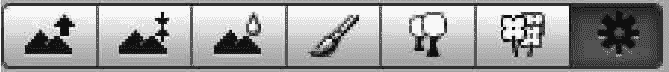
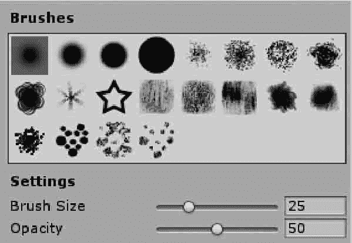
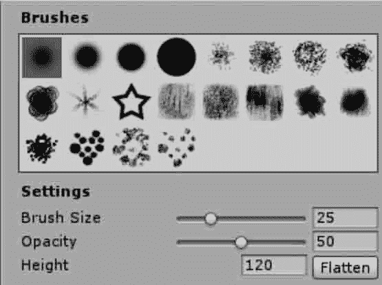
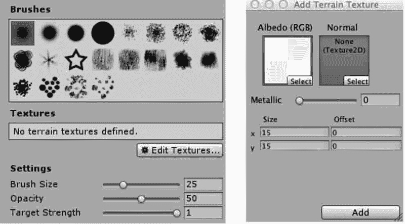
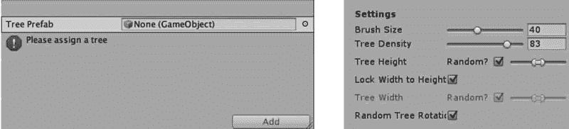
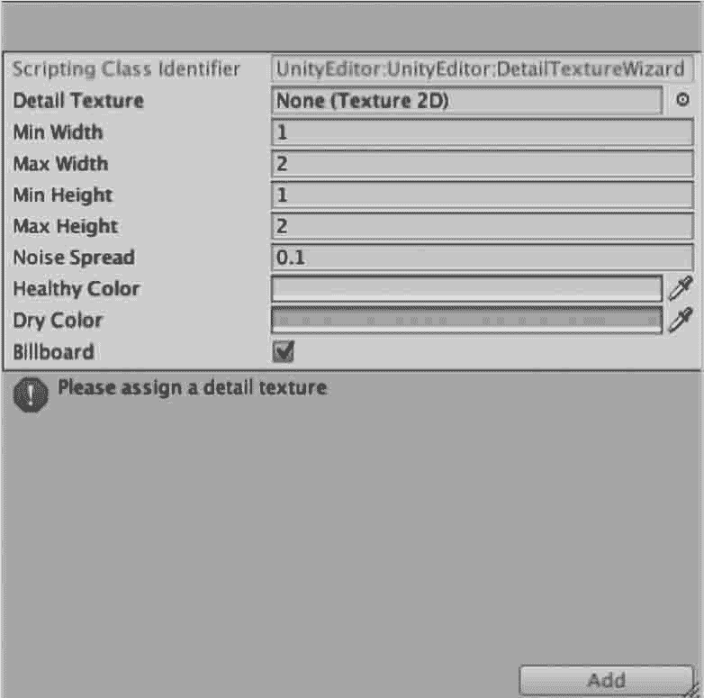
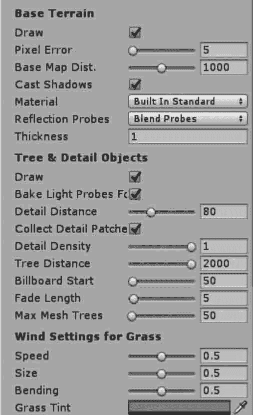
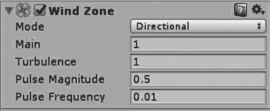

# Unity 3D 使用笔刷绘制地形

> 原文：[`c.biancheng.net/view/2741.html`](http://c.biancheng.net/view/2741.html)

在 Unity 3D 中，除了使用高度图来创建地形外，还可以使用笔刷绘制地形。

因为 Unity 3D 为游戏开发者提供了强大的地形编辑器，通过菜单中的 GameObject→3D Object→Terrain 命令，可以为场景创建一个地形对象。

初始的地表只有一个巨大的平面。Unity 3D 提供了一些工具，可以用来创建很多地表元素。

游戏开发者可以通过地形编辑器来轻松实现地形以及植被的添加。

地形菜单栏一共有 7 个按钮，含义分别为编辑地形高度、编辑地形特定高度、平滑过渡地形、地形贴图、添加树模型、添加草与网格模型、其他设置，如下图所示，每个按钮都可以激活相应的子菜单对地形进行操作和编辑。

## 地形高度绘制

在地形编辑器中，前 3 个工具用来绘制地形在高度上的变化。

左边第一个按钮激活 Raise/Lower Height 工具，如下图所示。

当使用这个工具时，高度将随着鼠标在地形上扫过而升高。

如果在一处固定鼠标，高度将逐渐增加。这类似于在图像编辑器中的喷雾器工具。如果鼠标操作时按下 Shift 键，高度将会降低。不同的刷子可以用来创建不同的效果。例如，创建丘陵地形时，可以通过 soft-edged 刷子进行高度抬升。

而对于陡峭的山峰和山谷，可以使用 hard-edged 刷子进行高度削减。

左边第二个工具是 Paint Height，类似于 Raise/Lower 工具，但多了一个属性 Height，用来设置目标高度，如下图所示。

当在地形对象上绘制时，此高度的上方区域会下降，下方的区域会上升。

游戏开发者可以使用高度属性来手动设置高度，也可以使用在地形上 Shift+ 单击对鼠标位置的高度进行取样。在高度属性旁边是一个 Flatten 按钮，它简单地拉平整个地形到选定的高度，这对设置一个凸起的地平线很有用。

如果要绘制的地表包含高出水平线和低于水平线的部分，例如在场景中创建高原以及添加人工元素（如道路、平台和台阶），Paint Height 都很方便。

左边第三个工具 Smooth Height 并不会明显地抬升或降低地形高度，但会平均化附近的区域。这缓和了地表，降低了陡峭变化，类似于图片处理中的模糊工具（blur tool）。

Smooth Height 可以用于缓和地表上尖锐、粗糙的岩石。地形表面平滑工具选项设置及功能介绍如下表所示。

| 参 数 | 含 义 | 功 能 |
| Brushes | 笔刷 | 设置笔刷的样式 |
| Setting | 设置 |   |
| Brushes Size | 笔刷尺寸 | 设置笔刷的大小 |
| Opacity | 不透明度 | 设置笔刷绘制时的高度 |
| Height | 高度 | 设置绘制高度的数值 |

## 地形纹理绘制

在地形的表面上可以添加纹理图片以创造色彩和良好的细节。

由于地形是如此巨大的对象，在实践中标准的做法是使用一个无空隙地（即连续地）重复的纹理，在表面上用它成片地覆盖，可以绘制不同的纹理区域以模拟不同的地面，如草地、沙漠和雪地。

绘制出的纹理可以在不同的透明度下使用，这样就可以在不同地形纹理间形成渐变，效果更自然。

地形编辑器左边第四个按钮是纹理绘制工具，单击该按钮并且在菜单中执行 Add Texture 命令，可以看到一个窗口，在其中可以设置一个纹理和它的属性。

添加的第一个纹理将作为背景使用而覆盖地形。如果想添加更多的纹理，可以使用刷子工具，通过设置刷子尺寸、透明度及目标强度（Target Strength）选项，实现不同纹理的贴图效果，如下图所示。地形纹理绘制工具选项如下表所示。

| 参 数 | 含 义 | 功 能 |
| Brushs | 笔刷 | 设置绘制地形纹理的笔刷样式 |
| Textures | 纹理 | 设置绘制地形纹理图片样式 |
| Setting | 设置 | 设置纹理相关参数 |
| Brush Size | 笔刷尺寸 | 设置绘制纹理的笔刷的大小 |
| Opacity | 不透明度 | 设置笔刷绘制纹理时的不透明度 |
| Target Strength | 目标强度 | 设置所绘制的贴图纹理产生的影响 |

## 树木绘制

Unity 3D 地形可以布置树木。可以像绘制高度图和使用纹理那样将树木绘制到地形上，但树木是固定的、从表面生长出的三维对象。

Unity 3D 使用了优化（例如，对远距离树木应用广告牌效果）来保证好的渲染效果，所以一个地形可以拥有上千棵树组成的茂密森林，同时保持可接受的帧率。

单击 Edit Trees 按钮并且选择 Add Tree 命令，将弹出一个窗口，从中选择一种树木资源。

当一棵树被选中时，可以在地表上用绘制纹理或高度图的方式来绘制树木，按住 Shift 键可从区域中移除树木，按住 Ctrl 键则只绘制或移除当前选中的树木。树木绘制面板如下图所示。树木绘制工具选项如下表所示。

| 参 数 | 含 义 | 功 能 |
| Setting | 设置 | 设置树木绘制相关参数 |
| Brush Size | 笔刷尺寸 | 设置种植树时笔刷的大小 |
| Tree Density | 树木密度 | 设置树的间距 |
| Tree Height | 树木高度 | 设置树的高度，勾选 Random 选项，可以出现树木高度 在指定范围内随机变化的效果 |
| Lock Width to Height | 锁定树木的宽高比 | 锁定树木宽高比 |
| Tree Width | 树木宽度 | 设置树的宽度，勾选 Random 选项，可以出现树木宽度 在指定范围内随机变化的效果 |
| Random Tree Rotation | 树木随机旋转 | 设置树木随机旋转一定的角度 |

## 草和其他细节

一个地形表面可以有草丛和其他小物体，比如覆盖表面的石头。草地使用二维图像进行渲染来表现草丛，而其他细节从标准网格中生成。

在地形编辑器中单击 Edit Details 按钮，在出现的菜单中将看到 Add Grass Texture 和 Add Detail Mesh 选项，选择 Add Grass Texture，在出现的窗口中选择合适的草资源，如下图所示。草绘制工具选项如下表所示。

| 参 数 | 含 义 | 功 能 |
| Detail Texture | 细节纹理 | 指定图片作为草的纹理 |
| Min Width | 最小宽度 | 设置草的最小宽度值 |
| Max Width | 最大宽度 | 设置草的最大宽度值 |
| Min Height | 最小高度 | 设置草的最小高度值 |
| Max Height | 最大高度 | 设置草的最大高度值 |
| Noise Spread | 噪波范围 | 控制草产生簇的大小 |
| Healthy Color | 健康颜色 | 设置草的健康颜色，此颜色在噪波中心处较为明显 |
| Dry Color | 干燥颜色 | 设置草的干燥颜色，此颜色在噪波中心处较为明显 |
| Billboard | 广告牌 | 草将随着摄像机同步转动，永远面向摄像机 |

## 地形设置

单击地形编辑器最右边的按钮可以打开地形设置面板，如下图所示。该面板用于设置地形参数，如下表所示。

基本地形参数：

| 参 数 | 含 义 | 功 能 |
| Draw | 绘制 | 绘制地形 |
| Pixel Error | 像素容差 | 显示地形网格时允许的像素容差 |
| Base Map Dist. | 基本地图距离 | 设置地形高度的分辨率 |
| Cast Shadows | 投影 | 设置地形是否有投影 |
| Material | 材质 | 为地形添加材质 |

树和细节参数：

| 参 数 | 含 义 | 功 能 |
| Draw | 绘制 | 设置是否渲染除地形以外的对象 |
| Detail Distance | 细节距离 | 设置摄像机停止对细节渲染的距离 |
| Detail Density | 细节密度 | 设置细节密度 |
| Tree Distance | 树木距离 | 设置摄像机停止对树进行渲染的距离 |
| Billboard Start | 开始广告牌 | 设置摄像机将树渲染为广告牌的距离 |
| Fade Length | 渐变距离 | 控制所有树的总量上限 |
| Max Mesh Trees | 网格渲染树木最大数量 | 设置使用网格形式进行渲染的树木最大数量 |

风参数：

| 参 数 | 含 义 | 功 能 |
| Speed | 速度 | 风吹过草地的速度 |
| Size | 大小 | 同一时间受到风影响的草的数量 |
| Bending | 弯曲 | 设置草跟随风弯曲的强度 |
| Grass Tint | 草的色调 | 设置地形上的所有草和细节网格的总体渲染颜色 |

## 风域

地形中的草丛在运行测试时可以随风摆动，如果要实现树木的枝叶如同现实中一样随风摇摆的效果，就需要加入风域。

执行 GameObject→3D Object→Wind Zone 菜单命令，创建一个风域，风域的参数如下图所示，风域参数如下表所示。

| 参 数 | 含 义 | 功 能 |
| Mode | 风域模式 | 设置风域模式：Directional 模式下整个场景中的树木都受影 响，Spherical 模式下只影响球体包裹范围内的树木 |
| Main | 主风 | 设置主要风力，产生风压柔和变化 |
| Turbulence | 湍流 | 设置湍流风，产生一个瞬息万变的风压 |
| Pulse Magnitude | 波动幅度 | 定义风力随时间的变化 |
| Pulse Frequency | 波动频率 | 定义风向改变的频率 |

风域不仅能实现风吹树木的效果，还能模拟爆炸时树木受到波及的效果。

需要注意的是，风域只能作用于树木，对其他游戏对象没有效果。场景中不同模式下的风域参数设置如下表所示。

| 实现的效果 | 参数 |
| Main | Turbulence | Pulse Magnitude | Pulse Frequency |
| 轻风吹效果 | 1 | 0.1 | 1.0 或以上 | 0.25 |
| 强气流效果 | 3 | 5 | 0.1 | 1.0 |