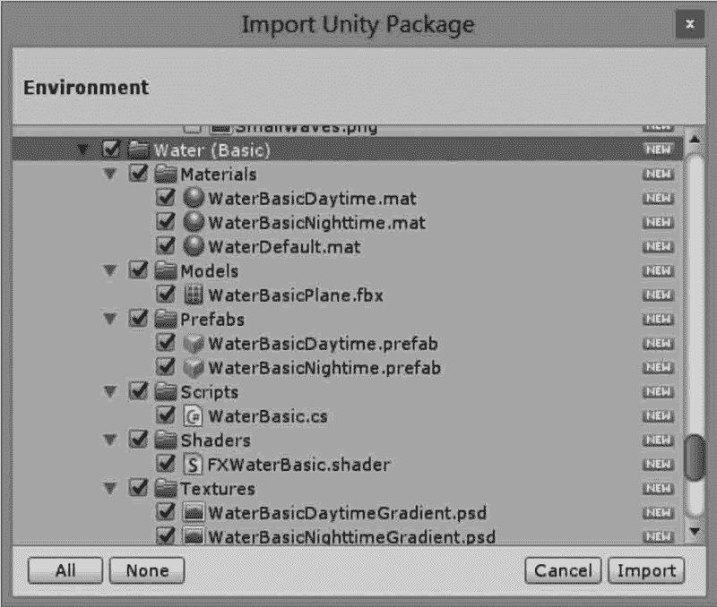
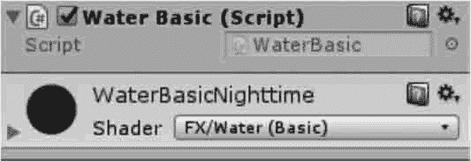
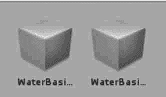
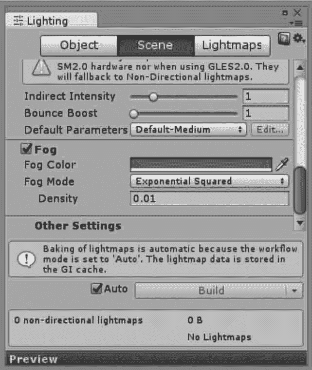
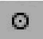
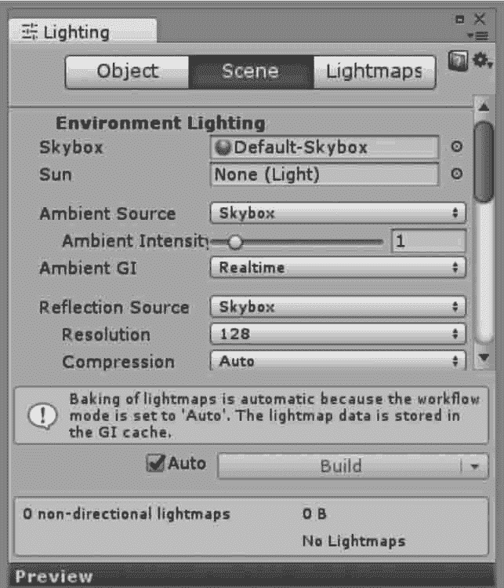
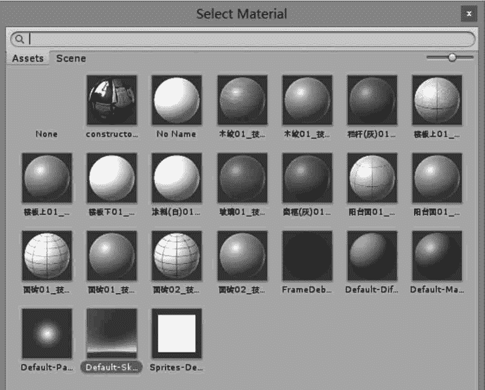

# Unity 3D 环境特效

> 原文：[`c.biancheng.net/view/2744.html`](http://c.biancheng.net/view/2744.html)

一般情况下，要在游戏场景中添加雾特效和水特效较为困难，因为需要开发人员懂得着色器语言且能够熟练地使用它进行编程。

Unity 3D 游戏开发引擎为了能够简单地还原真实世界中的场景，其中内置了雾特效并在标准资源包中添加了多种水特效，开发人员可以轻松地将其添加到场景中。

需要注意的是，由于 Unity 5.0 以上版本在默认情况下都没有自带的天空盒，只有包，所以当需要使用天空盒资源时，需要人工导入天空盒资源包。

## 水特效

在 Project 面板中右击，执行 Import Package→Environment 命令导入环境包，在打开的窗口中选中 Water 文件夹即可，然后单击 Import 按钮导入，如下图所示。

导入完成后，找到 Water 文件夹下的 Prefab 文件夹，其中包含两种水特效的预制件，可将其直接拖曳到场景中，这两种水特效功能较为丰富，能够实现反射和折射效果，并且可以对其波浪大小、反射扭曲等参数进行修改，如下图所示。

Water（Basic）文件夹下也包含两种基本水的预制件，如下图所示。

基本水功能较为单一，没有反射、折射等功能，仅可以对水波纹大小与颜色进行设置，由于其功能简单，所以这两种水所消耗的计算资源很小，更适合移动平台的开发。

## 雾特效

Unity 3D 集成开发环境中的雾有 3 种模式，分别为 Linear（线性模式）、Exponential（指数模式）和 Exponential Squared（指数平方模式），如下图所示。这 3 种模式的不同之处在于雾效的衰减方式。

场景中雾效开启的方式是，执行菜单栏 Window→Lighting 命令打开 Lighting 窗口，在窗口中选中 Fog 复选框，然后在其设置面板中设置雾的模式以及雾的颜色。

开启雾效通常用于优化性能，开启雾效后选出的物体被遮挡，此时便可选择不渲染距离摄像机较远的物体。

这种性能优化方案需要配合摄像机对象的远裁切面设置。通常先调整雾效，得到正确的视觉效果，然后调小摄像机的远裁切面，使场景中距离摄像机较远的游戏对象在雾效变淡前被裁切掉。雾效参数含义如下表所示。

| 参数 | 含 义 |
| Fog Color | 雾的颜色 |
| Fog Mode | 雾效模式 |
| Density | 雾效浓度，取值为 0〜1 |

## 天空盒

Unity 3D 中的天空盒实际上是一种使用了特殊类型 Shader 的材质，这种类型的材质可以笼罩在整个场景之外，并根据材质中指定的纹理模拟出类似远景、天空等效果，使游戏场景看起来更加完整。

目前 Unity 3D 中提供了两种天空盒供开发人员使用，其中包括六面天空盒和系统天空盒。这两种天空盒都会将游戏场景包含在其中，用来显示远处的天空、山峦等。

为了在场景中添加天空盒，在 Unity 3D 软件界面中，执行菜单 Window→Lighting 命令，可以打开渲染设置窗口，如下图所示。单击 Scene 页面 Environment Lighting 模块 Skybox 后面的选项设置按钮

出现材质选择对话框，双击即可选择不同材质的天空盒，如下图所示
 